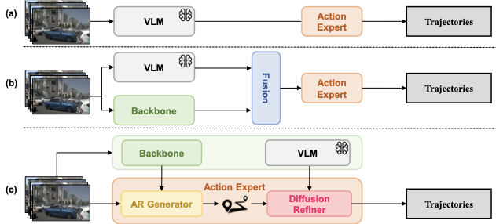
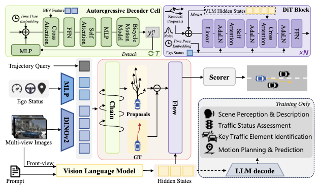
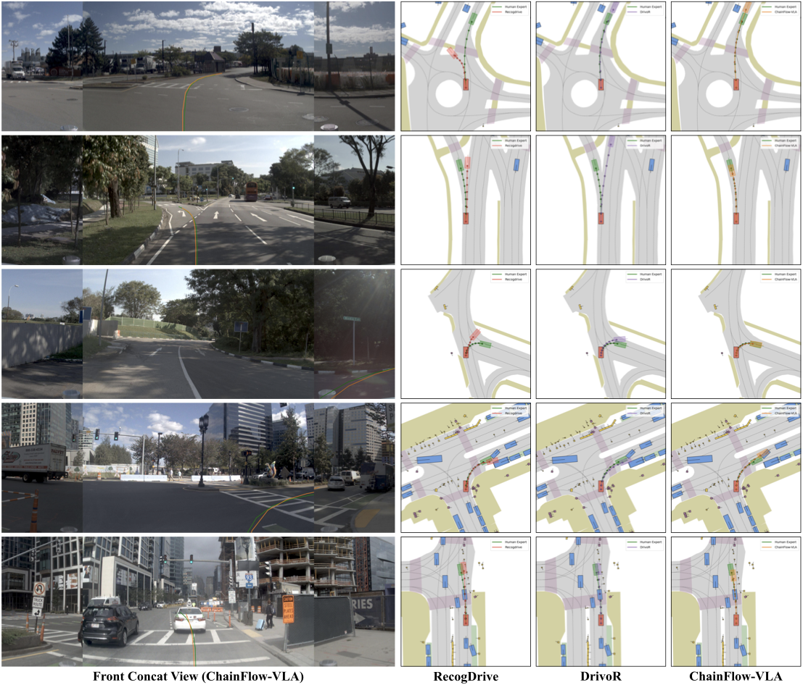
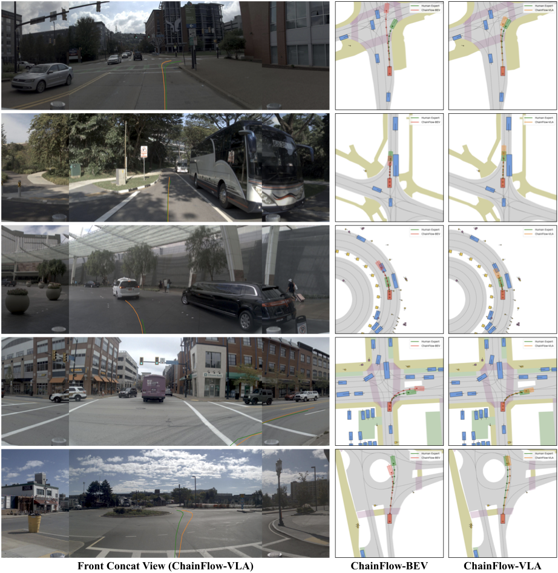

# ChainFlow-VLA: Causal Flow Planning with Vision-Language Models 精读报告

| 项目 | 信息 |
|------|------|
| 论文 | ChainFlow-VLA: Causal Flow Planning with Vision-Language Models |
| arXiv | [2605.23270](https://arxiv.org/abs/2605.23270) |
| 作者 | Xiyang Wang, Xinlin Wang, Tingguang Zhou, Gong Chen, Xingtai Gui, Zhi Xu, Xiaolei Wu, Feiyang Tan, Hangning Zhou, Mu Yang |
| 机构 | Afari Intelligent Drive; Tianjin University; University of Macau |
| 代码 | [AFARI-Research/ChainFlow-VLA](https://github.com/AFARI-Research/ChainFlow-VLA) |
| 任务 | NAVSIM v1 端到端自动驾驶轨迹规划 |

## 1. Motivation（问题背景）

端到端自动驾驶规划希望从多视角图像、历史状态和导航信号直接预测未来轨迹，但现有范式存在一个结构性错位：自回归模型擅长表达时间因果，却容易逐步累积误差；扩散模型擅长全局优化和多模态生成，却缺少显式因果约束；VLM 能做场景语义理解，但直接把语言视觉表征变成连续轨迹时，细粒度空间精度通常不够稳定。

相关工作中，[UniAD](https://openaccess.thecvf.com/content/CVPR2023/html/Hu_Planning-Oriented_Autonomous_Driving_CVPR_2023_paper.html) 与 [VAD](https://openaccess.thecvf.com/content/ICCV2023/html/Jiang_VAD_Vectorized_Scene_Representation_for_Efficient_Autonomous_Driving_ICCV_2023_paper.html) 代表判别式端到端规划；[DiffusionDrive](https://openaccess.thecvf.com/content/CVPR2025/html/Liao_DiffusionDrive_Truncated_Diffusion_Model_for_End-to-End_Autonomous_Driving_CVPR_2025_paper.html) 代表扩散式轨迹生成；[ReCogDrive](https://arxiv.org/abs/2506.08052) 代表将驾驶 VLM 表征引入规划的路线。ChainFlow-VLA 的核心动机是：不要把这些能力松散拼接，而是让 AR 先给出因果模式，再让 VLM 条件化的残差扩散在每个模式附近做语义修正。

> **图 1：不同 VLM 接入端到端自动驾驶规划的范式对比**（对应论文 Figure 1）
>
> 
>
> - **(a) VLM-guided pipeline**：VLM 只输出高层指导，再交给端到端模型执行，容易形成信息瓶颈。
> - **(b) Feature-level fusion**：VLM 特征与感知特征融合后进入动作专家，但缺少保证局部动力学与全局轨迹结构一致的机制。
> - **(c) ChainFlow-VLA**：AR Chain 先生成时序一致的轨迹 proposal，Flow 在 residual space 中用 VLM hidden states 做语义条件化扩散修正，把因果推理、全局优化和语义理解放进同一个分布分解里。

## 2. 一句话总结

ChainFlow-VLA 将自动驾驶规划建模为「因果轨迹模式生成 + VLM 条件化残差扩散修正」：Chain 用自回归 bicycle rollout 生成多模态可行轨迹，Flow 不从零生成轨迹，而是在每个 AR proposal 周围学习语义引导的 residual distribution，最终在 NAVSIM v1 上达到 PDMS 94.85，接近/匹配 human driver 94.8。

## 3. 核心贡献

1. **统一概率分解**：把轨迹分布写成 AR-induced modes 上的 mixture，每个 mode 再由 VLM-conditioned residual distribution 细化。
2. **Chain-to-Flow 规划范式**：Chain 负责时间因果和动力学可行性，Flow 负责全局几何一致性与细粒度纠偏。
3. **VLM 作为 refinement semantic controller**：论文不是让 VLM 直接生成动作，而是使用驾驶 VLM hidden states 条件化残差扩散。
4. **Residual-space diffusion**：相比直接在 trajectory space 建模，残差建模把复杂全局分布转成 proposal-centered local correction，实验中 PDMS 92.89 提升到 94.72。
5. **NAVSIM v1 SOTA**：ChainFlow-VLA(trainval) 在 PDMS、NC、DAC、EP、TTC 多项指标上领先，并在长尾场景定性结果中比 ReCogDrive/DrivoR 更稳。

## 4. 方法详述

### 4.1 问题定义

论文将端到端规划定义为条件轨迹分布建模：

$$
P(Y \mid \mathcal{O}),
$$

其中 $\mathcal{O}$ 表示多模态观测，$Y=\{y_t\}_{t=1}^{T}$ 是未来轨迹。AR 模型提供因果分解：

$$
P(Y_{\mathrm{AR}} \mid \mathcal{O})=\prod_t P(y_t \mid y_{<t}, \mathcal{O}).
$$

AR 先生成 $K$ 个轨迹模式 $\{Y_{\mathrm{AR}}^{(k)}\}_{k=1}^{K}$，Flow 学每个模式条件下的局部分布：

$$
\begin{aligned}
P(Y \mid Y_{\mathrm{AR}}^{(k)}, \mathcal{O})
&\approx
P(Y \mid Y_{\mathrm{AR}}^{(k)}, h_{\mathrm{VLM}}).
\end{aligned}
$$

最终得到 mixture 近似：

$$
\begin{aligned}
P(Y \mid \mathcal{O})
&\approx
\sum_{k=1}^{K}
P(Y \mid Y_{\mathrm{AR}}^{(k)}, h_{\mathrm{VLM}})
\cdot
P(Y_{\mathrm{AR}}^{(k)} \mid \mathcal{O}).
\end{aligned}
$$

### 4.2 整体 Pipeline

```text
multi-view images / ego history / navigation
        |
        v
BEV-style driving features + trajectory queries
        |
        v
Chain: autoregressive trajectory generation
        |
        +--> K causal proposals: Y_AR^(1), ..., Y_AR^(K)
        |
        v
VLM hidden states h_VLM from driving-oriented VLM
        |
        v
Flow: DiT residual diffusion conditioned on proposal + h_VLM
        |
        +--> refined trajectories: Y_hat_1, ..., Y_hat_K
        |
        v
multi-criteria scorer
        |
        v
final selected trajectory
```

> **图 2：ChainFlow-VLA 框架**（对应论文 Figure 2）
>
> 
>
> - **Autoregressive Trajectory Generation (Chain)**：从驾驶特征生成 $K$ 条 causal proposal，承担多模态与动力学可行性的初始建模。
> - **VLM-Guided Residual Diffusion (Flow)**：DiT 学习 proposal 到专家轨迹的 residual，并通过 cross-attention / adaptive LayerNorm 接收 VLM hidden states、时间步和 ego state 条件。
> - **Scorer**：对 refined candidates 做多准则打分，选出最终轨迹。

### 4.3 Chain：自回归轨迹生成

Chain 使用 $K$ 个并行轨迹假设表示多模态，每一步预测控制量：

$$
\begin{aligned}
(a_t^{(k)}, \omega_t^{(k)})
&=
H_\theta(y_{<t}^{(k)}, \mathcal{O}),
\end{aligned}
$$

并通过 bicycle model 得到下一状态：

$$
\begin{aligned}
y_t^{(k)}
&=
\mathrm{Bicycle}(y_{t-1}^{(k)}, a_t^{(k)}, \omega_t^{(k)}).
\end{aligned}
$$

经过 $T$ 步得到 proposal 集合：

$$
Y_{\mathrm{AR}}=\{Y_{\mathrm{AR}}^{(k)}\}_{k=1}^{K}.
$$

这一步的关键是让轨迹 proposal 本身具备因果顺序和物理可行性，而不是把所有细节都留给后续生成器。

### 4.4 Flow：VLM 引导的残差扩散

Flow 不直接生成 $Y$，而是将 refined trajectory 写成：

$$
Y=Y_{\mathrm{AR}}^{(k)}+\Delta Y_k.
$$

因此局部分布变为：

$$
\begin{aligned}
P(Y \mid Y_{\mathrm{AR}}^{(k)}, h_{\mathrm{VLM}})
&=
P(\Delta Y_k \mid Y_{\mathrm{AR}}^{(k)}, h_{\mathrm{VLM}}).
\end{aligned}
$$

给定 expert trajectory $Y^*$，残差目标是：

$$
\Delta Y_k^* = Y^* - Y_{\mathrm{AR}}^{(k)}.
$$

扩散前向加噪为：

$$
\begin{aligned}
\mathbf{z}_t^{(k)}
&=
\sqrt{\bar{\alpha}_t}\Delta Y_k^*
+
\sqrt{1-\bar{\alpha}_t}\boldsymbol{\epsilon}, \\
\boldsymbol{\epsilon}
&\sim
\mathcal{N}(\mathbf{0},\mathbf{I}).
\end{aligned}
$$

噪声预测网络为：

$$
\begin{aligned}
\hat{\boldsymbol{\epsilon}}^{(k)}
&=
\boldsymbol{\epsilon}_\theta(
\mathbf{z}_t^{(k)}, t, c_{\mathrm{ego}},
h_{\mathrm{VLM}}, Y_{\mathrm{AR}}^{(k)}).
\end{aligned}
$$

推理时通过 DDIM 采样残差，并恢复 refined trajectory：

$$
\begin{aligned}
\hat{Y}_k
&=
Y_{\mathrm{AR}}^{(k)}+\hat{\Delta Y}_k.
\end{aligned}
$$

### 4.5 训练目标

Stage I 训练 AR Chain 与 scorer：

$$
\begin{aligned}
\mathcal{L}_{\mathrm{stage1}}
&=
\mathcal{L}_{\mathrm{traj}}+\lambda_1\mathcal{L}_{\mathrm{scorer}}.
\end{aligned}
$$

Stage II 训练 Flow 与 scorer：

$$
\begin{aligned}
\mathcal{L}_{\mathrm{stage2}}
&=
\lambda_2\mathcal{L}_{\mathrm{diff}}
+
\lambda_3\mathcal{L}_{\mathrm{traj}}
+
\lambda_4\mathcal{L}_{\mathrm{scorer}}.
\end{aligned}
$$

论文采用 asymmetric WTA，把 diffusion supervision 绑定到距离 expert 最近的 AR proposal：

$$
\begin{aligned}
k^*
&=
\arg\min_k
\left\|Y_{\mathrm{AR}}^{(k)}-Y^*\right\|_2,
\end{aligned}
$$

扩散损失为：

$$
\begin{aligned}
\mathcal{L}_{\mathrm{diff}}
&=
\left\|\boldsymbol{\epsilon}-\boldsymbol{\epsilon}_{\theta}\right\|_2^2.
\end{aligned}
$$

实现细节：Stage 1 训练 25 epochs，Stage 2 训练 40 epochs；使用 8 张 NVIDIA A800；per-GPU batch size 为 8；基础学习率 $2\times10^{-4}$，按 $\sqrt{B/64}$ 缩放；前 10% steps linear warmup 后 cosine decay；$\lambda_1,\lambda_2,\lambda_3,\lambda_4=(1,10,20,4)$；推理默认 4-step denoising。

## 5. 训练与推理伪代码

```python
def train_stage1(batch):
    obs, y_star, nav, ego = batch
    driving_features = image_encoder_lora(obs, nav, ego)

    proposals = []
    for k in range(K):
        y_prev = ego.current_state
        traj = []
        hidden = init_query(k, driving_features)
        for t in range(T):
            a_t, omega_t, hidden = chain_decoder(hidden, y_prev, driving_features)
            y_t = bicycle_model(y_prev, a_t, omega_t)
            traj.append(y_t)
            y_prev = y_t
        proposals.append(stack(traj))

    best_k = argmin_l2(proposals, y_star)
    loss_traj = l2(proposals[best_k], y_star)
    scores = scorer(driving_features, proposals)
    loss_scorer = simulator_metric_supervision(scores, proposals, y_star)
    loss = loss_traj + lambda_1 * loss_scorer
    loss.backward()
    optimizer.step()


def train_stage2(batch):
    obs, y_star, nav, ego = batch
    driving_features = image_encoder_lora(obs, nav, ego)
    proposals = chain_generate(driving_features, ego, K, T)

    h_vlm = driving_vlm_hidden_states(obs, nav, ego)  # VLM used as semantic condition
    k_star = argmin_l2(proposals, y_star)
    residual_star = y_star - proposals[k_star]

    diffusion_t = sample_timestep()
    epsilon = normal_like(residual_star)
    z_t = sqrt(alpha_bar[diffusion_t]) * residual_star
    z_t += sqrt(1 - alpha_bar[diffusion_t]) * epsilon

    epsilon_hat = dit_refiner(
        noisy_residual=z_t,
        timestep=diffusion_t,
        ego_state=ego.current_state,
        vlm_hidden=h_vlm,
        ar_proposal=proposals[k_star],
    )
    loss_diff = mse(epsilon_hat, epsilon)

    refined = []
    for proposal in proposals:
        delta_hat = ddim_sample(dit_refiner, proposal, h_vlm, ego.current_state)
        refined.append(proposal + delta_hat)

    best_refined = argmin_l2(refined, y_star)
    loss_traj = l2(refined[best_refined], y_star)
    loss_scorer = simulator_metric_supervision(scorer(driving_features, refined), refined, y_star)
    loss = lambda_2 * loss_diff + lambda_3 * loss_traj + lambda_4 * loss_scorer
    loss.backward()
    optimizer.step()


def infer(obs, nav, ego):
    driving_features = image_encoder(obs, nav, ego)
    proposals = chain_generate(driving_features, ego, K, T)
    h_vlm = driving_vlm_hidden_states(obs, nav, ego)

    refined = []
    for proposal in proposals:
        delta_hat = ddim_sample(
            model=dit_refiner,
            condition={"proposal": proposal, "h_vlm": h_vlm, "ego": ego.current_state},
            steps=4,
        )
        refined.append(proposal + delta_hat)

    utility = scorer(driving_features, refined)
    return refined[argmax(aggregate_navsim_scores(utility))]
```

## 6. 实验结论

### 6.1 主实验结果

NAVSIM v1 中所有指标越高越好。论文报告 ChainFlow-VLA(trainval) 的 PDMS 为 94.8，摘要与 denoising ablation 中进一步给出 94.85。

| 方法 | 类别 | PDMS | NC | DAC | EP | TTC | Comf. |
|------|------|-----:|---:|----:|---:|----:|------:|
| RAP-DINO | End-to-End | 93.8 | 99.1 | 98.9 | 90.3 | 96.7 | 100.0 |
| DrivoR(trainval) | End-to-End | 93.7 | 99.0 | 98.9 | 90.0 | 96.7 | 100.0 |
| LatentVLA | VLA | 92.4 | 98.9 | 98.2 | 88.2 | 96.0 | 100.0 |
| ReCogDrive | VLA | 90.8 | 97.9 | 97.3 | 87.3 | 94.9 | 100.0 |
| Human Driver | Oracle | 94.8 | 100.0 | 100.0 | 87.5 | 100.0 | 99.9 |
| ChainFlow-VLA(train) | Ours | 93.6 | 98.8 | 98.6 | 90.8 | 96.1 | 100.0 |
| ChainFlow-VLA(trainval) | Ours | 94.8 | 99.2 | 99.0 | 91.9 | 97.2 | 99.9 |

关键观察：ChainFlow-VLA 的 EP 达到 91.9，比 Human Driver 表中 EP 87.5 更高，同时 NC/DAC/TTC 保持接近满分，说明它不是通过冒险推进换取分数，而是在安全约束下提升路线进度。

> **图 3：NAVSIM 代表场景中的轨迹定性对比**（对应论文 Figure 3）
>
> 
>
> - 绿色是 GT，红色是 ReCogDrive，紫色是 DrivoR，橙色是 ChainFlow-VLA。
> - 在环岛、左转匝道、急转弯、右转绕行静止车辆和道路障碍物等场景中，ChainFlow-VLA 更贴近可行车道与导航意图。
> - 论文强调两类 baseline 容易出现偏离 drivable area、进入错误车道、追尾或撞障碍物，而 ChainFlow-VLA 能在长尾交互场景中保持 collision-free。

### 6.2 组件消融

| ID | AR Gen. | DiT Refiner | VLM Guidance | PDMS | NC | DAC | EP | TTC | Comf. |
|----|:-------:|:-----------:|:------------:|-----:|---:|----:|---:|----:|------:|
| 0 | 否 | 否 | 否 | 93.7 | 99.0 | 98.9 | 90.0 | 96.7 | 100.0 |
| 1 | 是 | 否 | 否 | 94.0 | 99.1 | 98.9 | 90.8 | 96.7 | 99.9 |
| 2 | 是 | 是 | 否 | 94.1 | 99.1 | 98.9 | 91.0 | 96.7 | 99.9 |
| 3 | 是 | 是 | 是 | 94.8 | 99.2 | 99.0 | 91.9 | 97.2 | 99.9 |

AR Chain 先带来 +0.3 PDMS，残差 DiT 再带来 +0.1，加入 VLM guidance 后整体提升达到 +1.1。最大变化来自 EP，说明 VLM hidden states 对「该如何在当前语义场景中修正 proposal」尤其有帮助。

### 6.3 DiT 设计消融

| 设计项 | 选项 | PDMS |
|--------|------|-----:|
| Modeling Target | Trajectory space | 92.89 |
| Modeling Target | Residual space | 94.72 |
| DiT Blocks | 8 | 94.64 |
| DiT Blocks | 12 | 94.72 |
| VLM Guidance Source | Action QA | 94.11 |
| VLM Guidance Source | Env. & Traj. QA | 94.72 |

残差空间是最关键的设计之一：它把从零生成轨迹变成对 AR proposal 的低方差纠偏。VLM guidance source 的结果也说明，环境理解和轨迹问答产生的 hidden states 比 action-only QA 更适合做 refinement 条件。

### 6.4 Denoising Steps

| $N_{\mathrm{step}}$ | 2 | 4 | 8 | 12 | 16 |
|--------------------:|--:|--:|--:|---:|---:|
| PDMS | 94.68 | 94.72 | 94.74 | 94.85 | 94.67 |

12-step 达到最高 94.85；论文默认使用 4-step，是性能和推理效率之间的折中。16-step 反而下降，说明更长 denoising 并不必然更优。

### 6.5 泛化到不同规划范式

| Backbone | Modes | 原始 PDMS | + ChainFlow PDMS | 提升 |
|----------|------:|----------:|-----------------:|-----:|
| DiffusionDrive | 20 -> 6 | 88.1 | 88.9 | +0.8 |
| iPad | 64 -> 64 | 91.7 | 92.7 | +1.0 |

这组实验没有使用 VLM features，目标是验证 ChainFlow 作为 action expert 的通用性。结果显示，不论原 backbone 是 diffusion-based 还是 score-based，ChainFlow 都能带来稳定收益。

> **图 4：BEV-conditioned 与 VLM-conditioned refinement 的定性对比**（对应论文 Figure 4）
>
> 
>
> - 绿色是 GT，红色是 ChainFlow-BEV，橙色是 ChainFlow-VLA。
> - BEV 条件在右转、窄路巡航、跟车、环岛等场景中容易产生错误朝向、碰撞边界或追尾。
> - VLM hidden states 提供路线意图、交通语义和轨迹可行性信息，使 residual diffusion 更像「语义纠偏器」而不是普通几何平滑器。

### 6.6 鲁棒性分析

论文的鲁棒性证据主要来自三部分：第一，NAVSIM 长尾定性场景中，ChainFlow-VLA 能处理环岛、急转、静态障碍和右转绕行；第二，VLM-conditioned refinement 相比 BEV-conditioned refinement 在多类复杂场景中避免碰撞；第三，ChainFlow 在不同 backbone 上均有提升，说明 causal proposal + residual refinement 不是只服务于单一架构的局部技巧。

## 7. KnowHow（核心洞察）

1. **VLM 更适合作为修正条件，而不是连续轨迹生成器**：VLM 的优势在语义理解和意图判断，直接输出高精度控制量反而暴露空间精度短板。
2. **AR proposal 是 mode prior**：Chain 先把复杂未来空间离散成 $K$ 个可行模式，Flow 只需在每个模式附近学习 residual。
3. **Residual diffusion 降低学习难度**：建模 $\Delta Y$ 比建模 $Y$ 更接近局部高斯修正，优化方差更低。
4. **因果性与全局性必须分工**：AR 的逐步因果结构天然稳定，但局部贪心；扩散的全局 denoising 能修正形状，但需要可靠 anchor。
5. **VLM hidden states 的注入位置很关键**：把语义放到 final residual denoising 阶段，比早期 feature fusion 更直接影响轨迹纠偏。
6. **EP 是主要收益来源**：实验中安全指标已很高，真正的增益来自更好地理解路线和场景，使车辆能在安全前提下更有效前进。
7. **少步扩散足够有效**：4-step 已达到 94.72，说明 proposal-centered residual space 让扩散采样不必很长。
8. **ChainFlow 可迁移**：在 DiffusionDrive 和 iPad 上加入 ChainFlow 也提升，说明该思想有可能成为通用 action expert 组件。

## 8. arXiv Appendix 关键点总结

当前 arXiv 源码中没有正式展开的 Appendix A/B/C/D/E/F/G 章节；论文的补充信息主要以内嵌实验、实现细节和 limitations 形式出现在主文。因此这里按已验证内容总结，不编造不存在的附录结构。

| 类型 | 关键点 |
|------|--------|
| 实现细节 | 8 张 NVIDIA A800；Stage 1 训练 25 epochs；Stage 2 训练 40 epochs；AdamW；per-GPU batch size 8；base LR $2\times10^{-4}$；10% warmup + cosine decay。 |
| VLM 设置 | 采用 ReCogDrive 风格的 driving-oriented 2B VLM，由 InternVL fine-tuned，并使用 environment-understanding 与 trajectory-QA hidden states 做条件。 |
| 损失权重 | $\lambda_1,\lambda_2,\lambda_3,\lambda_4=(1,10,20,4)$。 |
| 推理设置 | 默认 4-step DDIM；12-step 取得最高 PDMS 94.85，但默认选择 4-step 以平衡效率。 |
| 局限性 | 当前 Flow 本质上仍是 trajectory refinement，不是真正的 action generation；未来可设计 score-oriented / judge-oriented VLM，让 VLM 更贴合轨迹质量评估。 |

## 9. 总结

ChainFlow-VLA 的贡献可以压缩成三点：第一，把自动驾驶轨迹规划拆成 AR causal proposal 和 VLM-conditioned residual flow，并用 mixture formulation 统一；第二，证明 VLM hidden states 更适合作为语义纠偏条件，而不是直接动作生成器；第三，在 NAVSIM v1 上以 94.85 PDMS 达到人类水平附近，并通过组件消融、设计消融和定性结果说明每个模块的作用。

最重要的 insight 是：对连续控制问题来说，强语义模型不一定要站在输出端直接生成动作，它也可以站在残差修正端，告诉一个已有可行动力学 proposal「应该往哪里修」。这比早期融合更晚、更窄，但也更有效。

## 参考链接

| 资源 | 链接 |
|------|------|
| **论文** | [arXiv:2605.23270](https://arxiv.org/abs/2605.23270) |
| **PDF** | [arXiv PDF](https://arxiv.org/pdf/2605.23270) |
| **代码** | [GitHub: AFARI-Research/ChainFlow-VLA](https://github.com/AFARI-Research/ChainFlow-VLA) |
| **NAVSIM** | [NAVSIM benchmark](https://arxiv.org/abs/2406.15349) |
| **UniAD** | [CVPR 2023 Paper](https://openaccess.thecvf.com/content/CVPR2023/html/Hu_Planning-Oriented_Autonomous_Driving_CVPR_2023_paper.html) |
| **VAD** | [ICCV 2023 Paper](https://openaccess.thecvf.com/content/ICCV2023/html/Jiang_VAD_Vectorized_Scene_Representation_for_Efficient_Autonomous_Driving_ICCV_2023_paper.html) |
| **DiffusionDrive** | [CVPR 2025 Paper](https://openaccess.thecvf.com/content/CVPR2025/html/Liao_DiffusionDrive_Truncated_Diffusion_Model_for_End-to-End_Autonomous_Driving_CVPR_2025_paper.html) |
| **ReCogDrive** | [arXiv:2506.08052](https://arxiv.org/abs/2506.08052) |
