# DAWN 论文精读报告

> **论文**: The DAWN of World-Action Interactive Models
> **arXiv**: [2605.11550](https://arxiv.org/abs/2605.11550) [cs.RO]
> **作者**: Hongbo Lu, Liang Yao, Chenghao He, Haoyu Wang, Xiang Gu, Xianfei Li, Wenlong Liao, Tao He, Pai Peng
> **机构**: COWARobot Co. Ltd · Shanghai Jiao Tong University · Hohai University
> **日期**: 2026年5月12日（v1）
> **代码**: [COOWAI/DAWN](https://github.com/COOWAI/DAWN)
> **项目主页**: [https://cowarobot-ai.github.io/](https://cowarobot-ai.github.io/)

---

## 0. 引用信息表

| 信息项 | 内容 |
|--------|------|
| 论文标题 | The DAWN of World-Action Interactive Models |
| arXiv ID | 2605.11550 [cs.RO] |
| 方法全称 | DAWN: Denoising Actions and World iNteractive model |
| 作者 | Hongbo Lu, Liang Yao, Chenghao He, Haoyu Wang, Xiang Gu, Xianfei Li, Wenlong Liao, Tao He, Pai Peng |
| 机构 | COWARobot Co. Ltd; Shanghai Jiao Tong University; Hohai University |
| 提交时间 | 2026-05-12（v1） |
| 任务领域 | 自动驾驶规划、World Action Model、World-Action Interactive Model、短 latent rollout |
| 主干模型 | V-JEPA 2 Large vision backbone + Auto-Encoder Resampler + causal World Predictor + DiT-style Action Denoiser |
| Benchmark | NAVSIM v1, NAVSIM v2, nuScenes |

---

## 1. Motivation（问题背景）

### 1.1 WAM 的核心缺口：动作与世界不是单向关系

World Model 试图预测环境如何演化，World Action Model（WAM）进一步把未来世界和动作放到同一建模框架里。但自动驾驶里的关键未来并不是一个静态、被动的“场景预测结果”：一个缝隙是否可行、其他车是否让行、碰撞风险是否出现，都依赖 ego car 正在考虑的动作。

论文的核心判断是：**好的世界预测依赖候选动作，好的动作也依赖世界如何演化**。现有 WAM 往往没有显式处理这种互相塑形的关系。

### 1.2 Related Works 与本文要解决的问题

| 方向 | 代表工作 | 主要局限 |
|------|----------|----------|
| 并行式 WAM | [Epona](https://arxiv.org/abs/2506.24113), World Action Models, VAViM/VAVAM | 世界和动作可以共享上下文，但生成时通常不是递归互相修正 |
| 顺序式预测-规划 | [ImagiDrive](https://arxiv.org/abs/2508.11428), Forecasting-to-Planning | 先固定未来假设，再在其上规划；动作不能反过来改变未来假设 |
| 零 rollout WAM | [Fast-WAM](https://arxiv.org/abs/2603.16666) | 证明训练时 world modeling 有用，但复杂交互场景中完全取消测试时未来演化可能不足 |
| 自动驾驶端到端规划 | UniAD, VAD, GenAD, Drive-JEPA 等 | 可获得强规划结果，但不一定提供“世界-动作联合推理”的清晰机制 |

DAWN 要解决的是：在不做昂贵 pixel-space full rollout 的情况下，保留一个足够短、足够紧凑、且与动作递归耦合的 latent future，让未来世界和动作假设在推理时共同收敛。

> **图 1：From WAMs to WAIM. Existing WAMs typically predict world and action in parallel, sequentially, or without explicit test-time rollout. In contrast, WAIM keeps a short latent world rollout and recursively couples world prediction with action generation during inference.**（对应论文 Figure 1）
>
> 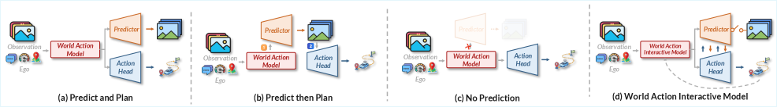
>
> - **并行式**：世界分支和动作分支共享输入，但生成过程里彼此不能递归纠偏。
> - **顺序式**：先预测未来，再规划动作；未来一旦生成就被固定。
> - **零 rollout**：推理时直接动作预测，效率高，但在强交互场景里可能缺少显式前瞻。
> - **WAIM/DAWN**：短 latent world rollout 与 action denoising 交替进行，世界假设和动作假设共同更新。

---

## 2. 一句话总结

DAWN 提出 World-Action Interactive Model（WAIM）范式：让世界预测和动作生成在推理时递归互相条件化，并用短 latent rollout 支撑长时域自动驾驶轨迹生成，在 NAVSIM v1 perception-free 设置达到 PDMS 89.1，在 nuScenes 上达到平均 L2 0.33 m、平均碰撞率 0.11%。

---

## 3. 核心贡献

1. **提出 WAIM 范式**：将 WAM 从“联合输出世界和动作”推进到“世界与动作作为耦合变量共同推理”，强调 action-contingent reciprocity。
2. **提出 DAWN 架构**：用 World Predictor 和 World-Conditioned Action Denoiser 递归交互，实现短 latent rollout + 动作去噪的闭环推理。
3. **避免 pixel-space full rollout**：DAWN 在紧凑语义 latent 空间中演化未来，用少量 latent token 支撑长时域轨迹生成，控制推理成本。
4. **验证双向耦合确实重要**：移除 World->Action 后 PDMS 从 87.9 降到 81.6，移除 Action->World 后降到 84.9。
5. **在自动驾驶基准上取得强结果**：NAVSIM v1 perception-free PDMS 89.1；nuScenes 平均 L2 0.33 m、平均碰撞率 0.11%；NAVSIM v2 暴露了 DAC/碰撞相关指标仍需加强。

---

## 4. 方法详述

### 4.1 问题定义

给定当前观察 $o$ 和任务/路线条件 $l$，标准策略直接建模动作 chunk：

$$
p(a_{1:H} \mid o, l)
$$

WAM 引入未来世界表示 $v_{1:T}$，建模联合分布：

$$
p(v_{1:T}, a_{1:H} \mid o, l)
$$

动作分布可以看作对未来世界边缘化：

$$
p(a_{1:H} \mid o, l)
=
\int p(v_{1:T}, a_{1:H} \mid o, l)\, dv_{1:T}
$$

DAWN 的 WAIM 定义进一步要求世界和动作形成自洽对：

$$
\hat{v}_{1:T} = F_{\theta}(o, l, \hat{a}_{1:H}),
\qquad
\hat{a}_{1:H} = G_{\phi}(o, l, \hat{v}_{1:T})
$$

实际中通过迭代交互实现：

$$
(v_{1:T}^{(k+1)}, a_{1:H}^{(k+1)})
=
\mathcal{I}_{\Theta}(v_{1:T}^{(k)}, a_{1:H}^{(k)}; o, l)
$$

这就是本文区分 WAM 与 WAIM 的关键：WAM 只是联合建模未来世界和动作，WAIM 则要求二者在推理过程中通过交互共同形成。

### 4.2 整体 Pipeline

```text
当前多帧相机观察 o + 路线/ego-state 等条件 c
        │
        ▼
Student Vision-Encoder: V-JEPA 2 Large
        │
        ▼
Auto-Encoder Resampler
        │
        └── 压缩为 compact latent world tokens z（默认 16 tokens）
        │
        ▼
Action Denoiser 初始 proposal
        │
        ▼
a_{1:H}^{(0)}
        │
        ├──────────────┐
        ▼              │
World Predictor        │
P_theta(z, c, a^k)     │
        │              │
        ▼              │
z_future^{k+1}          │
        │              │
        ▼              │
World-Conditioned Action Denoiser
G_phi(q_ref^k, c, z_future^{k+1}, a^k)
        │
        ▼              │
a_{1:H}^{(k+1)} ───────┘  递归 K 轮（默认 4 轮）
        │
        ▼
Action Head 解码最终轨迹 tau_hat
```

> **图 2：Overview of DAWN. During training, DAWN learns compact latent world tokens with a Student/Teacher Vision-Encoder pair and an Auto-Encoder Resampler, supervises short latent rollout with a World Predictor, and trains a World-Conditioned Action Denoiser for trajectory generation. During inference, the Action Denoiser initializes actions from resampler latents and then recursively refines them with predictor rollouts. This couples world prediction and action generation in latent space without pixel-space future rendering.**（对应论文 Figure 2）
>
> 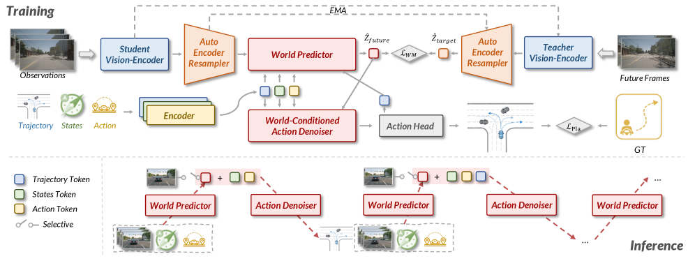
>
> - **Student/Teacher Vision-Encoder**：Student 编码当前观察，Teacher 在训练时编码未来观察作为 latent supervision。
> - **AE Resampler**：把 dense V-JEPA token 压成少量 latent world token，降低 rollout 和 denoising 成本。
> - **World Predictor**：根据当前 latent、条件 token 和当前动作假设，预测短未来 latent。
> - **World-Conditioned Action Denoiser**：用预测出的未来 latent 修正动作假设，动作再反馈给 World Predictor。

### 4.3 DAWN 架构细节

| 模块 | 设计 | 作用 |
|------|------|------|
| Student Vision-Encoder | V-JEPA 2 Large | 提取当前观察 dense visual tokens |
| Teacher Vision-Encoder | V-JEPA 2 Large，训练时使用 | 编码未来观察，生成 world predictor 的监督目标 |
| Auto-Encoder Resampler | token-space bottleneck autoencoder | 将 dense tokens 压缩到 compact latent world tokens |
| World Predictor | causal Transformer | 根据当前 latent 和动作假设 rollout 未来 latent |
| Action Denoiser | DiT-style diffusion planner | 条件化 latent world context，去噪得到轨迹 token |
| Action Head | lightweight decoder | 将 denoised action states 解码为最终轨迹 |

当前观察编码为：

$$
u = E_{\mathrm{stu}}(o)
$$

经过 resampler 压缩：

$$
z = R_{\mathrm{stu}}(u)
$$

训练时未来观察经 Teacher 分支得到 target future latent：

$$
z_{\mathrm{target}} = R_{\mathrm{tea}}(E_{\mathrm{tea}}(o^{+}))
$$

### 4.4 递归世界-动作交互

DAWN 首先从当前 latent 生成初始动作 proposal：

$$
a_{1:H}^{(0)} = G_{\phi}(q_{\mathrm{prop}}, c, z)
$$

然后执行递归交互：

$$
z_{\mathrm{future}}^{(r)} = P_{\theta}(z, c, a_{1:H}^{(r)})
$$

$$
a_{1:H}^{(r+1)} = G_{\phi}(q_{\mathrm{ref}}^{(r)}, c, z_{\mathrm{future}}^{(r)}, a_{1:H}^{(r)})
$$

这里 $q_{\mathrm{prop}}$ 和 $q_{\mathrm{ref}}^{(r)}$ 是区分 proposal/refinement 角色的 query embedding；denoiser 权重共享，只改变输入来源和角色 query。这个设计使得 DAWN 可以在同一个动作生成器里同时完成“从零提出轨迹”和“基于世界 rollout 修正轨迹”。

### 4.5 训练流程

DAWN 采用四阶段训练：

| 阶段 | 训练目标 | 关键作用 |
|------|----------|----------|
| Stage 1 | 在 OpenScene、DrivingDojo、CoVLA 等驾驶视频上预训练 Student Vision-Encoder | 获得强视觉先验 |
| Stage 2 | 训练 Auto-Encoder Resampler | 学到 compact token-space bottleneck |
| Stage 3 | 在 nuScenes、NAVSIM 等任务数据上训练 World Predictor | 学会短 latent future rollout |
| Stage 4 | 联合训练 World Predictor、Action Denoiser、Action Head | 形成完整 WAIM 交互推理能力 |

实现细节：输入视频 2 Hz，主实验裁剪/缩放到 $512 \times 256$；消融用 $256 \times 256$；Action Denoiser 使用 5 个 DPM-Solver++ sampling steps；训练 150 epochs，peak learning rate $1 \times 10^{-4}$，初始学习率 $5 \times 10^{-5}$，8 warmup epochs，weight decay 0.04；大规模结果使用 80 张 NVIDIA A100。

---

## 5. 训练与推理伪代码

### 5.1 训练伪代码

```python
def train_dawn(D_pre, D_task):
    # Stage 1: vision pretraining
    E_stu = pretrain_vjepa2_on_driving_videos(D_pre)
    E_tea = ema_copy(E_stu)

    # Stage 2: token-space autoencoder resampler
    R_stu, R_tea = train_resampler_autoencoder(E_stu, E_tea, D_pre)

    # Stage 3: world predictor
    P = init_causal_transformer()
    for o, l, o_future in D_task:
        z = R_stu(E_stu(o))
        z_target = R_tea(E_tea(o_future))
        z_pred = P(z, encode_condition(l))
        loss_world = distance(z_pred, z_target)
        update(P, loss_world)

    # Stage 4: joint world-action training
    G = init_dit_action_denoiser()
    H_act = init_action_head()
    for o, l, o_future, tau_gt in D_task:
        c = encode_condition(l)
        z = R_stu(E_stu(o))
        z_target = R_tea(E_tea(o_future))

        action = G(q_prop, c, z)
        for r in range(R):
            z_future = P(z, c, action)
            action = G(q_ref[r], c, z_future, action)

        tau_pred = H_act(action)
        loss = world_loss(z_future, z_target) + planning_loss(tau_pred, tau_gt)
        update([P, G, H_act], loss)

    return E_stu, R_stu, P, G, H_act
```

### 5.2 推理伪代码

```python
def infer_dawn(o, l, K=4):
    z = R_stu(E_stu(o))
    c = encode_condition(l)

    action = G(q_init, c, z)
    for k in range(K):
        z_future = P(z, c, action)
        action = G(q_ref[k], c, z_future, action)

    tau_hat = H_act(action)
    return tau_hat
```

---

## 6. 实验结论

### 6.1 主实验：NAVSIM v1

| Type | Method | Inputs | NC | DAC | EP | C | TTC | PDMS |
|------|--------|--------|----|-----|----|---|-----|------|
| Perception-based | DriveSuprim | Camera | 98.6 | 98.6 | 91.3 | 100 | 95.5 | 93.5 |
| Perception-free | Drive-JEPA | Camera | 98.7 | 96.2 | 82.9 | 100 | 95.5 | 89.0 |
| Perception-free | DAWN* | Camera | 98.2 | 95.8 | 84.2 | 100 | 95.8 | 87.9 |
| Perception-free | **DAWN** | Camera | **98.7** | 95.9 | **84.3** | 100 | **96.0** | **89.1** |

DAWN 在 perception-free 组取得最高 PDMS 89.1，并在 NC、Ego Progress、TTC 上达到该组最佳。与 DAWN* 相比，$512 \times 256$ 主实验配置相较 $256 \times 256$ 版本把 PDMS 从 87.9 提升到 89.1。

### 6.2 主实验：nuScenes

| Method | L2 1s | L2 2s | L2 3s | L2 Avg. | Col. 1s | Col. 2s | Col. 3s | Col. Avg. |
|--------|-------|-------|-------|---------|---------|---------|---------|-----------|
| World4Drive | 0.23 | 0.47 | 0.81 | 0.50 | 0.00 | 0.12 | 0.33 | 0.16 |
| WorldRFT | 0.21 | 0.44 | 0.76 | 0.47 | 0.10 | 0.11 | **0.23** | 0.15 |
| **DAWN** | **0.17** | **0.31** | **0.52** | **0.33** | **0.00** | **0.10** | **0.23** | **0.11** |

nuScenes 上 DAWN 同时降低轨迹误差和碰撞率，尤其是 2s/3s 中长时域误差显著下降，说明递归世界-动作交互并不只是让轨迹更保守，而是提高了规划精度和安全性。

### 6.3 消融实验：关键组件

| AE Resampler | Predictor | Interactive | NC | DAC | EP | C | TTC | PDMS |
|--------------|-----------|-------------|----|-----|----|---|-----|------|
| - | - | - | 97.1 | 92.2 | 78.8 | 100 | 91.5 | 82.9 |
| yes | - | - | 97.2 | 92.2 | 78.7 | 100 | 91.7 | 82.8 |
| yes | yes | - | 97.4 | 94.3 | 80.4 | 100 | 91.5 | 85.2 |
| yes | yes | yes | **98.2** | **95.8** | **84.2** | **100** | **95.8** | **87.9** |

结论很清楚：AE Resampler 本身不是主要性能来源；World Predictor 带来显式 temporal reasoning；真正最大增益来自 Interactive 机制，它把 latent future rollout 转化为动作修正。

### 6.4 消融实验：交互轮数

| 交互轮数 | NC | DAC | EP | C | TTC | PDMS |
|----------|----|-----|----|---|-----|------|
| 1 | 97.4 | 94.3 | 80.4 | 100 | 91.5 | 85.2 |
| 2 | 97.8 | 95.1 | 81.6 | 100 | 94.1 | 86.4 |
| 3 | 98.1 | 95.6 | 82.8 | 100 | 95.6 | 86.9 |
| 4 | **98.2** | **95.8** | **84.2** | **100** | **95.8** | **87.9** |
| 5 | 98.1 | 95.4 | 83.9 | 100 | 95.7 | 87.2 |
| 6 | 98.0 | 95.6 | 82.8 | 100 | 95.6 | 86.9 |

> **图 3：Effect of interactive rounds.**（对应论文 Figure 3）
>
> 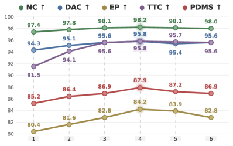
>
> - 1 到 4 轮持续提升，说明递归交互确实在逐步修正动作假设。
> - 4 轮之后性能回落，说明过多 refinement 可能带来过修正或额外误差积累。
> - 论文默认使用 4 轮，作为质量和推理成本的折中点。

### 6.5 消融实验：World-Action Coupling

| Method | NC | DAC | EP | C | TTC | PDMS |
|--------|----|-----|----|---|-----|------|
| DAWN | **98.2** | **95.8** | **84.2** | **100** | **95.7** | **87.9** |
| w/o World -> Action | 96.6 | 91.9 | 78.6 | 99.9 | 91.6 | 81.6 |
| w/o Action -> World | 97.3 | 94.3 | 80.2 | 100 | 92.7 | 84.9 |

World -> Action 更关键：如果预测世界不能条件化动作 denoising，PDMS 下降 6.3；Action -> World 也重要，去掉动作条件的世界 rollout 后 PDMS 下降 3.0。这支持 WAIM 的核心论点：收益不是“多喂 latent token”，而是“未来世界和动作互相约束”。

### 6.6 消融实验：World Rollout Horizon

| $T_w$ | $H_a$ | PDMS | w/o Int. | Latency (ms) |
|-------|-------|------|----------|--------------|
| 0s | 4s | 82.8 | 82.8 | 331.253 |
| 1s | 4s | 84.7 | 83.9 | 503.261 |
| 2s | 4s | 87.3 | 84.3 | 690.540 |
| 3s | 4s | 87.5 | 84.6 | 849.512 |
| 4s | 4s | 87.9 | 85.2 | 1067.975 |

> **图 5：Illustration of the latent world rollout design space. Zero-rollout methods such as Fast-WAM occupy the left endpoint, full predict-then-plan methods occupy the right endpoint, and DAWN targets a short-rollout regime in between, where compact future evolution provides useful foresight without full-horizon rollout.**（对应论文 Figure 5）
>
> 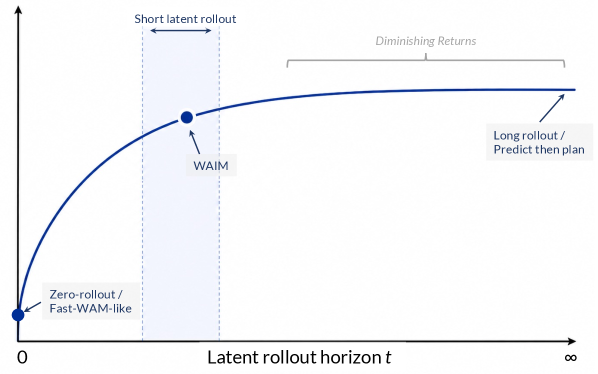
>
> - 0s rollout 对应 Fast-WAM 式极端：推理时不显式演化未来。
> - 4s rollout 接近 full horizon，但延迟达到 1067.975 ms。
> - 2-3s rollout 已接近 4s 性能，说明 DAWN 需要的是 action-relevant short future，而不是完整未来重建。

### 6.7 定性结果

> **图 4：Qualitative planning results. We compare human trajectories, Drive-JEPA, and DAWN in five representative driving scenarios. The top row shows front-view observations, and the bottom row shows the corresponding BEV visualization. DAWN produces trajectories that better follow road geometry and remain visually consistent with human driving behavior in complex intersections, narrow streets, and curved junctions.**（对应论文 Figure 4）
>
> 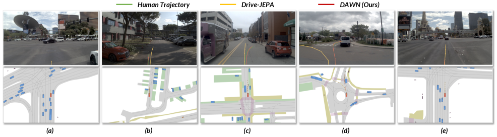
>
> - 在窄路、弯道路口、复杂交叉口等场景，DAWN 的轨迹更贴合道路几何。
> - 对比 Drive-JEPA，DAWN 更少出现轨迹偏向路边或车辆附近的现象。
> - 这与定量 TTC/碰撞指标一致：短 latent future 提供了更强的安全相关约束。

### 6.8 NAVSIM v2：重要负结果

| Method | NC | DAC | DDC | TL | EP | TTC | LK | HC | EC | EPDMS |
|--------|----|-----|-----|----|----|-----|----|----|----|-------|
| Drive-JEPA | 98.4 | 98.6 | 99.1 | 99.8 | 88.4 | 97.8 | 97.6 | 97.9 | 84.8 | 87.8 |
| **DAWN** | 97.3 | 92.0 | 99.1 | 99.7 | 87.4 | 96.6 | 96.0 | 98.3 | **85.5** | 83.2 |

NAVSIM v2 上 DAWN 的 EPDMS 不是最强，主要短板来自 DAC 和碰撞相关指标。论文也明确指出：DAWN 的交互 latent rollout 改善了规划质量和舒适性，但严格规则合规仍是后续方向。

---

## 7. KnowHow（核心洞察）

1. **WAM 的关键不是“有没有预测未来”，而是“预测的未来是否受动作约束”**：自动驾驶未来是 action-contingent 的，固定未来再规划会遗漏交互性。
2. **DAWN 站在 Fast-WAM 和 full rollout 中间**：Fast-WAM 说明很多收益来自训练时 world modeling；DAWN 则说明复杂驾驶仍需要一点测试时 latent future。
3. **短 rollout 可以支撑长动作**：世界分支不必覆盖完整 action horizon，只需提供关键的 action-relevant dynamics。
4. **World -> Action 比 Action -> World 更敏感，但两者都必要**：这解释了为什么只把 world latent 当额外条件不够，动作也必须反馈给世界预测。
5. **压缩不是越大越好**：16 tokens 到 64 tokens 只带来 PDMS 82.8 到 83.2 的小增益，却让延迟从 331.3 ms 涨到 963.6 ms。
6. **4 轮交互像一个经验最优固定点**：少于 4 轮没有充分吸收未来约束，多于 4 轮收益消失甚至下降。
7. **latent-space rollout 的代价是可解释性下降**：比 pixel/BEV/occupancy future 更难检查错误来源，这是 safety-critical deployment 的风险点。
8. **NAVSIM v2 结果提醒不要只看一个榜单**：DAWN 在 v1/nuScenes 很强，但 v2 DAC 短板说明 rule compliance 仍需结构化约束或后处理。

---

## 8. arXiv Appendix 关键点总结

论文 appendix 没有按 A/B/C/D/E/F/G 字母编号，而是按章节编号组织。对应要点如下：

| Appendix 部分 | 核心内容 |
|----------------|----------|
| Limitations | WAIM 适合 action-contingent 交互问题，但不保证递归交互收敛或安全；短 latent rollout 可能不足以覆盖长链交互；compact latent 可解释性较弱。 |
| Broader Impact | 更强的未来后果推理可能提升自动驾驶安全与平顺性，但也可能带来过度信任、区域泛化不均、隐私和误用风险。 |
| More Experiments Details | 详细定义 NAVSIM v1/v2 与 nuScenes 指标；补充输入 2 Hz、$512 \times 256$、4 帧观察、12 帧未来 latent、16 latent tokens、World Predictor 12 层等实现细节。 |
| More Quantitative Results | 给出 NAVSIM v2 表格、组件消融完整指标、交互轮数完整表、resampler token 完整表。 |
| More Qualitative Results | 补充 planning、prediction 和 feature map 可视化。 |
| Pseudo Code of DAWN | 给出 DAWN Training 与 DAWN Inference 两段算法伪代码。 |

### Appendix qualitative figures

> **图 6：More qualitative results of planning.**（对应论文 Appendix Figure: More qualitative results of planning）
>
> 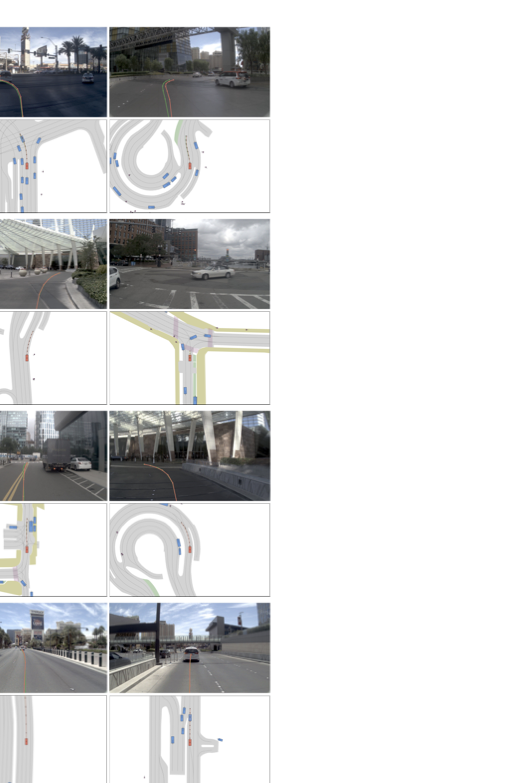
>
> - 该图补充更多驾驶场景下的规划轨迹，对主文 Figure 4 的五个代表场景做扩展。
> - 从 front-view 与 BEV 轨迹对比可以继续看到 DAWN 的轨迹更贴合道路几何和可行驶区域。

> **图 7：More qualitative results of prediction.**（对应论文 Appendix Figure: More qualitative results of prediction, part 1）
>
> 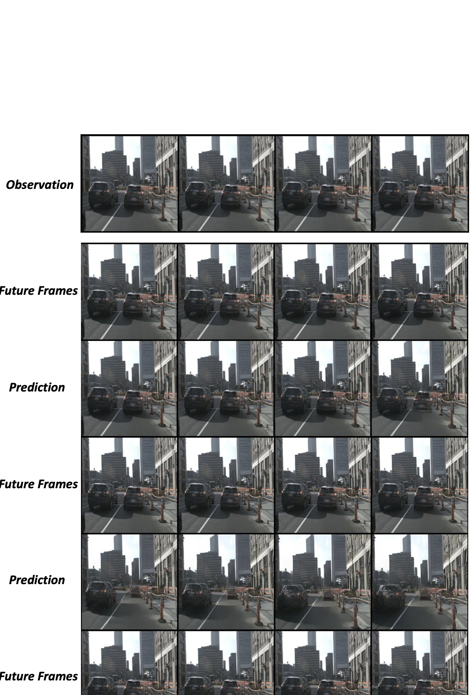
>
> - 展示 DAWN latent world rollout 对未来场景演化的预测效果。
> - 这些预测图不是直接用于 pixel-space planning，而是用于验证 compact latent 是否保留了 action-relevant dynamics。

> **图 8：More qualitative results of prediction.**（对应论文 Appendix Figure: More qualitative results of prediction, part 2）
>
> 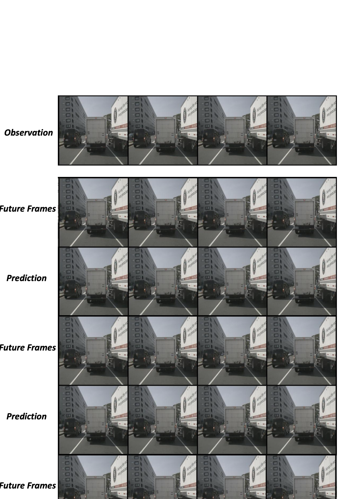
>
> - 第二组预测样例继续覆盖不同道路结构和交通参与者布局。
> - 结合 rollout horizon 消融可看出：短未来预测足以提供规划约束，完整长时域重建并非必要。

> **图 9：More qualitative results of prediction.**（对应论文 Appendix Figure: More qualitative results of prediction, part 3）
>
> 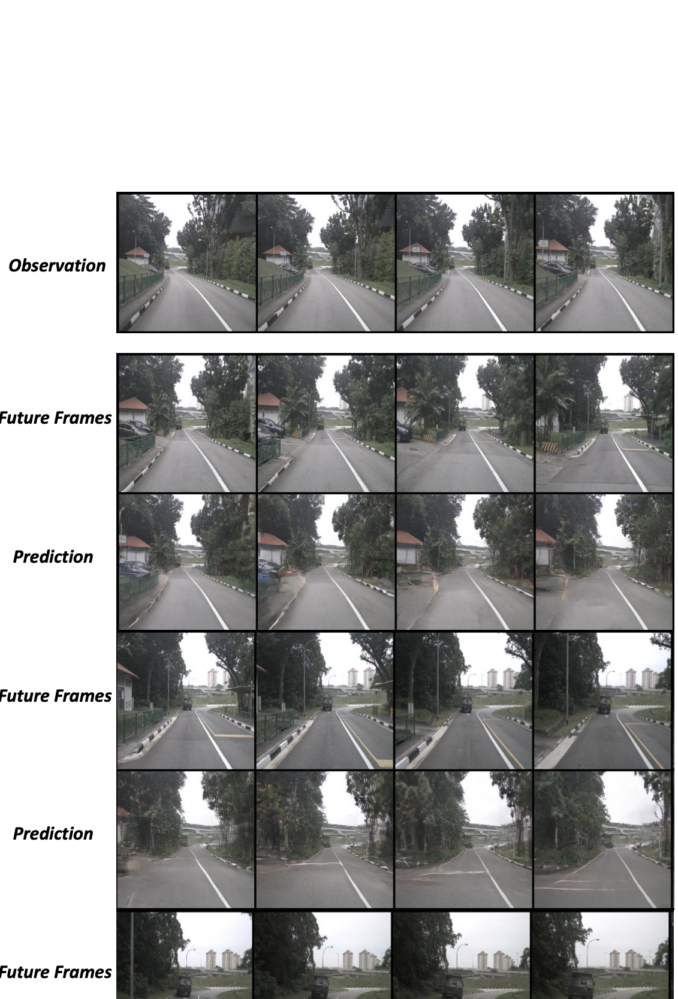
>
> - 第三组预测样例补充复杂场景下的时序一致性观察。
> - 这部分主要支撑论文对 World Predictor 的解释：预测分支不是独立展示用的未来生成器，而是 action denoising 的动态条件。

> **图 10：More qualitative results of feature.**（对应论文 Appendix Figure: More qualitative results of feature, part 1）
>
> 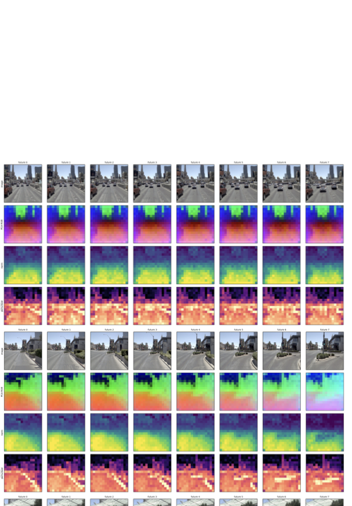
>
> - 特征图展示 DAWN 在 latent token 层面对道路结构、车辆和可行驶区域的聚焦。
> - 它补充说明 AE Resampler 压缩后的 latent 仍保留了规划相关视觉信息。

> **图 11：More qualitative results of feature.**（对应论文 Appendix Figure: More qualitative results of feature, part 2）
>
> 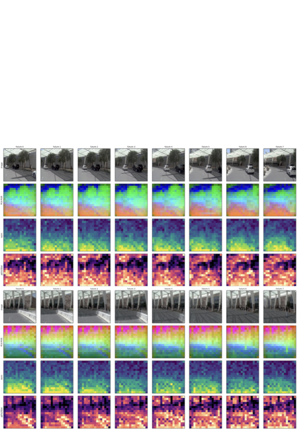
>
> - 第二组 feature 可视化进一步展示不同场景下的 latent 表征分布。
> - 结合 token 数消融，16 个 latent tokens 是性能与延迟的折中点，而不是简单追求更高压缩率。

---

## 9. 总结

DAWN 的最大价值不是把自动驾驶规划指标又推高一点，而是给 WAM 提出一个更明确的下一步定义：**World Action Model 不应只是同时预测世界和动作，而应让二者在推理时互相修正，形成自洽的未来-动作对**。

三点最重要贡献：

1. **概念上**：提出 WAIM，把 action-contingent reciprocity 作为世界模型走向可行动性的核心原则。
2. **方法上**：用短 latent rollout + DiT action denoising 实现递归 world-action interaction，避免 pixel-space full rollout 的高成本。
3. **实验上**：通过组件、交互方向、轮数和 rollout horizon 消融证明性能来自真正的双向耦合，而不是单纯更多 token 或更长未来预测。

最重要洞察：**未来不必被完整生成，但必须能被动作改变；动作不必等待完整未来，但必须被未来约束。** 这正是 DAWN 相对 Fast-WAM、Epona、传统预测-规划框架最值得记住的地方。

---

## 参考链接

| 资源 | 链接 |
|------|------|
| **论文** | [arXiv:2605.11550](https://arxiv.org/abs/2605.11550) |
| **HTML** | [arXiv HTML](https://arxiv.org/html/2605.11550v1) |
| **PDF** | [arXiv PDF](https://arxiv.org/pdf/2605.11550) |
| **代码** | [GitHub: COOWAI/DAWN](https://github.com/COOWAI/DAWN) |
| **项目主页** | [Project Page](https://cowarobot-ai.github.io/) |
| **博客解读** | [待验证] |
