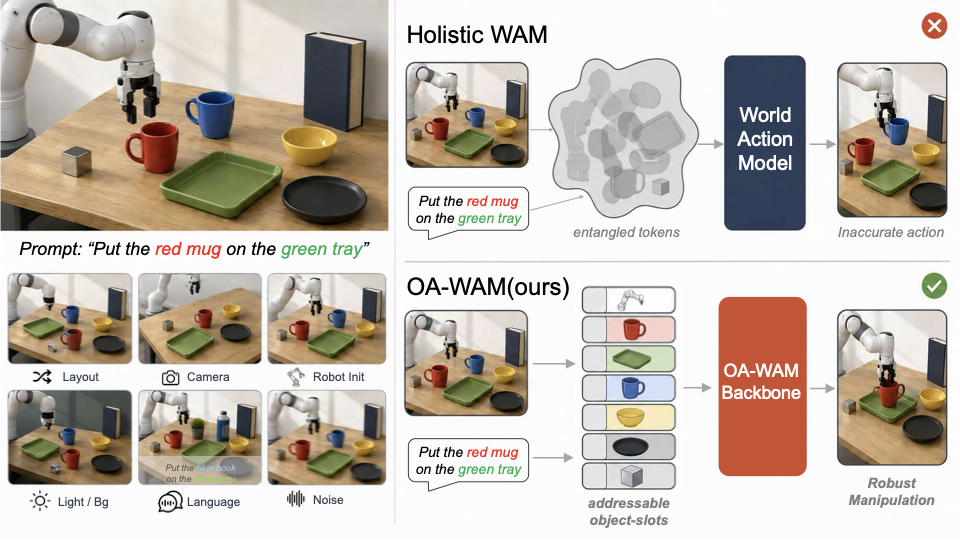
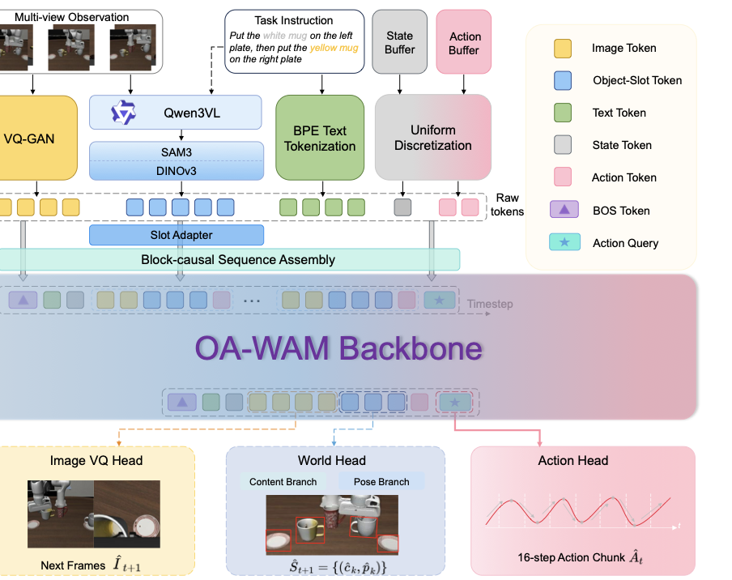
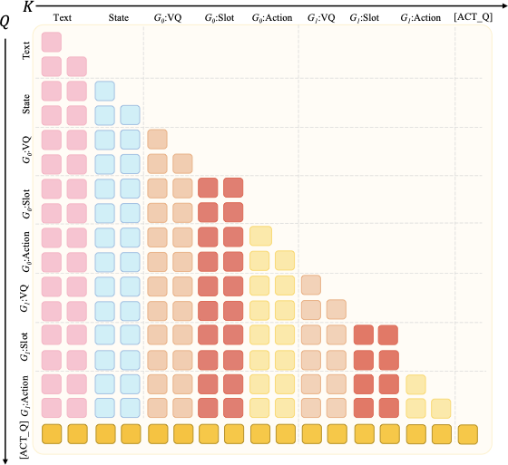
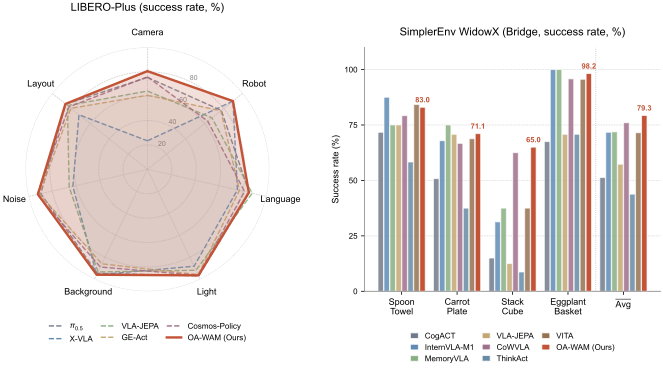
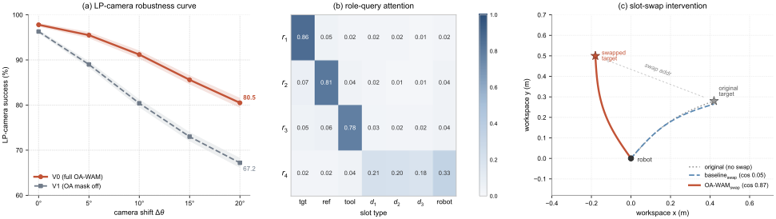
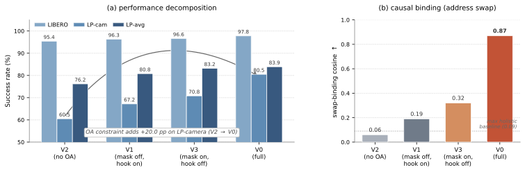
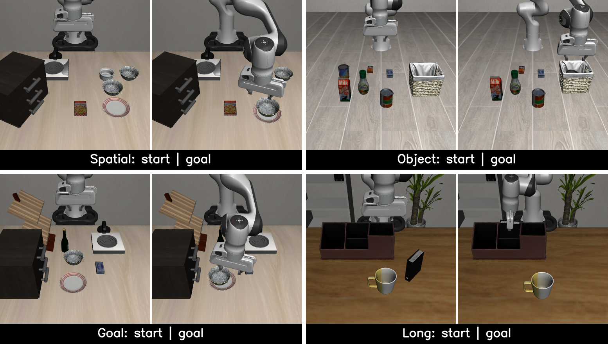
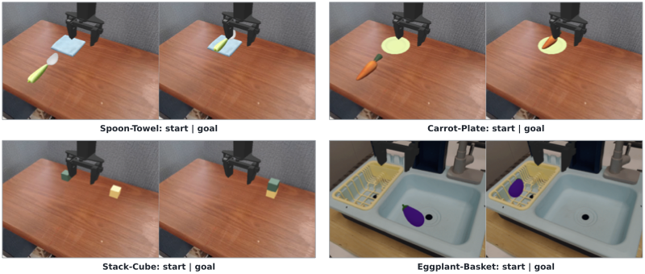
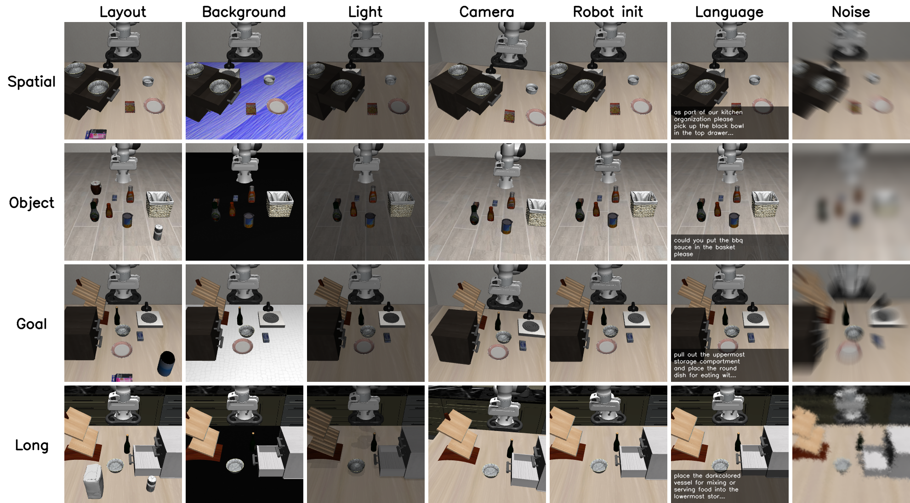

# OA-WAM: Object-Addressable World Action Model for Robust Robot Manipulation 精读报告

> 论文：OA-WAM: Object-Addressable World Action Model for Robust Robot Manipulation  
> arXiv：2605.06481  
> 作者：Yushan Liu, Peibo Sun, Shoujie Li, Yifan Xie, Lingfeng Zhang, Xintao Chao, Shiyuan Dong, Fang Chen, Xiao-Ping Zhang, Wenbo Ding  
> 机构：Tsinghua University, Shanghai Jiao Tong University, Nanyang Technological University  
> 主题：World Action Model / Object-centric World Model / Robot Manipulation

## 1. Motivation（问题背景）

World Action Models (WAM) 的核心目标，是让策略同时具备“预测世界怎么变”和“决定机器人怎么动”的能力。但已有 WAM/VLA 往往把未来世界表示成整张图像、视频 token 流或全局 latent，这会让“目标物体是谁”与“周围上下文是什么”强耦合。场景一旦发生相机视角、机器人初始位姿、布局扰动等变化，目标物体本身仍然可见，但全局表示可能把目标身份和背景、邻近物体、相机姿态一起缠住，动作头因此漂移到错误目标。

相关脉络包括：[OpenVLA](https://arxiv.org/abs/2406.09246) 将开源 VLA 推到通用机器人操作，[π0](https://www.physicalintelligence.company/blog/pi0) 与 π0.5 强调高频连续动作解码，[WorldVLA](https://arxiv.org/abs/2506.21539) 引入世界模型辅助动作生成，[VLA-JEPA](https://arxiv.org/abs/2509.06939) 用预测式表征学习改善 VLA。OA-WAM 认为这些方法的共同短板不是动作头能力不足，而是缺少一个可被动作头直接寻址的对象级世界接口。

> **图 1：Overview of OA-WAM. Under scene perturbations (left, six typical axes), holistic WAMs entangle target identity with context in global tokens and drift to wrong actions (top right). Our OA-WAM (bottom right) decomposes each frame into N+1 addressable object slots whose cross-slot attention key reads only the identity address subvector, keeping robust manipulation.**（对应论文 Figure 1）
>
> 
>
> - 左侧展示 LIBERO-Plus 中的典型扰动轴：相机、机器人初始位姿、布局、光照、背景、语言/传感器噪声等。
> - 上方 holistic WAM 用全局 token 表示世界，目标身份容易和场景上下文绑定，扰动后动作漂移。
> - 下方 OA-WAM 把每一帧拆成 robot slot + object slots，并让跨 slot 注意力的 key 只读取对象身份地址 `addr`，从结构上把“找哪个物体”和“物体当前状态”分开。

## 2. 一句话总结

OA-WAM 将世界-动作模型改造成对象可寻址结构：每个物体 slot 拥有固定身份地址 `addr` 与动态内容 `content`，Transformer 的跨 slot key 只能读取 `addr`，从而让动作头在场景几何扰动下仍能稳定绑定语言指定的目标物体。

## 3. 核心贡献

1. **提出 Object Addressability 问题定义**：指出 WAM 在机器人操作中的关键瓶颈，是目标对象身份被全局世界 token 与上下文纠缠。
2. **设计对象可寻址 slot 表示**：每帧拆成 `N+1` 个 slot，包含 1 个机器人 slot 与最多 `N=16` 个对象 slot；每个对象 slot 由固定 `addr` 与动态 `cnt` 组成。
3. **提出 OA attention 机制**：slot 位置的 key projection 仅能读取前 32 维身份地址，并在每层后重置地址子空间，防止 residual stream 把 content 混入 address。
4. **统一世界预测与动作生成**：world head 预测下一帧对象 content/pose，flow-matching action head 一次解码 16 步连续动作块。
5. **用因果 slot intervention 验证机制**：目标 slot 地址交换后，OA-WAM 的末端轨迹会朝交换后的目标偏转，swap-binding cosine 达到 `0.87`，而 holistic baseline 均不超过 `0.09`。

## 4. 方法详述

### 4.1 问题定义

在时间步 `t`，机器人观察历史 RGB、7 维本体状态、语言指令以及过去动作，模型一次前向输出长度为 `H=16` 的动作块，并预测下一帧对象状态：

$$
\bigl(\mathbf{A}_t,\,\widehat{\mathcal{S}}_{t+1}\bigr)
\sim
\pi_\theta\!\bigl(\mathbf{I}_{\le t},\,\mathbf{q}_{\le t},\,\ell,\,\mathbf{a}_{<t}\bigr)
$$

其中：

$$
\mathbf{A}_t=(\mathbf{a}_t,\dots,\mathbf{a}_{t+H-1})\in\mathbb{R}^{H\times 7},\quad H=16
$$

$$
\widehat{\mathcal{S}}_{t+1}
=
\{(\hat{\mathbf{c}}_k^{t+1},\hat{\mathbf{p}}_k^{t+1})\}_{k=1}^{N}
$$

### 4.2 对象 slot tokenization 与整体 Pipeline

OA-WAM 使用冻结感知栈产生六路 token：BPE text、Qwen3-VL noun phrases、Chameleon VQ-GAN image codes、SAM3+DINOv3+pose object slots、256-bin proprioception、256-bin past actions。其中只有 slot stream 引入新参数，其余复用 Chameleon embedding table。

每个 slot 的 320 维向量为：

$$
\mathbf{s}_k^t =
\bigl[
\underbrace{\mathbf{addr}_k}_{32}
\Vert
\underbrace{\mathbf{cnt}_k^t}_{256}
\Vert
\underbrace{\boldsymbol{\pi}^t}_{16}
\Vert
\underbrace{\boldsymbol{\rho}_k}_{16}
\bigr]\in\mathbb{R}^{320}
$$

其中 `addr_k` 在 `t=0` 由语言标签与初始 DINOv3 特征计算并在 episode 内固定；`cnt_k^t` 每帧重算，表示时变外观、位姿、形状等内容；`pi^t` 是时间编码；`rho_k` 是 robot/object/padding 角色编码。

```text
Language instruction
        |
        +--> Qwen3-VL noun phrases ----+
                                       v
RGB frames --> SAM3 masks --> DINOv3 slot features --> [addr || cnt || time || role]
        |                                      |
        +--> Chameleon VQ-GAN image codes      +--> slot adapter: R^320 -> R^4096

Proprioception + past actions + text + image codes + slot embeddings
        |
        v
Block-causal Chameleon-7B slot-aware trunk
        |
        +--> World head: next slot content / pose
        |
        +--> [ACT-Q] flow head: 16-step continuous action chunk
```

> **图 2：OA-WAM architecture. Multi-modal inputs are encoded into each token streams: object-slot tokens via SAM3+DINOv3, projected by a learnable slot adapter; Only slot tokens introduce learnable parameters; the others reuse frozen embed_tokens. Tokens are assembled into a block-causal sequence terminated by a learnable action query [ACT-Q] and processed by the slot-aware backbone. The world head reads slot hiddens to predict next-frame per-slot (cnt_hat, pose_hat) as auxiliary supervision; the action head decodes a 16-step action chunk.**（对应论文 Figure 2）
>
> 
>
> - `T2/I-A/I-B/S/A-d` 分别对应文本、图像 VQ、对象 slot、本体状态、过去动作。
> - `[ACT-Q]` 是动作查询 token，最终 hidden 被 flow-matching action head 读取。
> - world head 不直接生成整图，而是预测每个对象 slot 的下一帧 content 和 pose。

### 4.3 Object-addressable attention

OA-WAM 的关键结构约束是：在 slot 位置，key projection 的输入只保留前 32 维 address，其余维度置零；query/value 仍读取完整 residual state。

$$
\mathbf{K}_k^{(\ell)} =
W_K^{(\ell)}\cdot
\mathrm{mask}_{\le 32}(\mathbf{x}_k^{(\ell)})
$$

$$
\mathbf{Q}_k^{(\ell)}=W_Q^{(\ell)}\mathbf{x}_k^{(\ell)},\quad
\mathbf{V}_k^{(\ell)}=W_V^{(\ell)}\mathbf{x}_k^{(\ell)}
$$

每层 Transformer block 后，OA-WAM 再执行一个 reset hook：

$$
\mathbf{x}_k^{(\ell+1)}[1{:}32]\leftarrow \mathbf{addr}_k
$$

这个 hook 的意义是防止残差更新把动态 content 混进 address 子空间。于是每一层的 slot routing key 都只依赖固定身份地址，而对象当前状态仍可通过 value 与 residual stream 参与动作生成。

> **图 3：OA attention mask. Block-causal across frames; within-frame slots are bidirectional (red diagonal). W_K reads only addr_k (first 32 dims).**（对应论文 Figure 3）
>
> 
>
> - 时间维度采用 block-causal mask，当前帧不能看未来帧。
> - 同一帧内部的 slot 之间允许双向注意力，以保持对象集合的 permutation equivariance。
> - `W_K` 只读 `addr`，使“被谁寻址”与“当前内容是什么”解耦。

### 4.4 Prediction heads 与损失函数

World head 读取 slot hidden，分别预测下一帧 content 与 pose：

$$
\mathcal{L}_\mathrm{world}
=
\frac{1}{N}\sum_{k=1}^{N}m_k^\mathrm{obj}
\Bigl(
\|\hat{\mathbf{c}}_k^{t+1}-\mathbf{c}_k^{t+1}\|_2^2
+
\lambda_p\|\hat{\mathbf{p}}_k^{t+1}-\mathbf{p}_k^{t+1}\|_2^2
\Bigr)
$$

Action head 是条件 flow matching MLP，输入 `[ACT-Q]` hidden 和 noisy action chunk，学习从噪声到真实动作块的 velocity field：

$$
\mathcal{L}_\mathrm{act}
=
\mathbb{E}_{\tau,\epsilon}
\left\|
\mathbf{v}_\xi(\mathbf{A}_t^\tau,\tau,\mathbf{H}_{\textsc{act\_q}})
-
(\mathbf{A}_t-\epsilon)
\right\|_2^2
$$

$$
\mathbf{A}_t^\tau=\tau\mathbf{A}_t+(1-\tau)\epsilon,\quad
\tau\sim\mathcal{U}(0,1),\quad
\epsilon\sim\mathcal{N}(0,I)
$$

总损失为：

$$
\mathcal{L}(\theta)
=
\mathcal{L}_\mathrm{act}
+
\lambda_w\mathcal{L}_\mathrm{world}
+
\lambda_v\mathcal{L}_\mathrm{vq}
+
\lambda_c\mathcal{L}_\mathrm{compose}
+
\lambda_r\mathcal{L}_\mathrm{role}
$$

权重固定为 `{0.5, 0.04, 0.1, 0.05}`；`compose` 在前 30% 训练线性 warmup，`role` 在训练前半段使用后退火为 0。

### 4.5 训练配置

OA-WAM 的 trunk 是 Chameleon-style 7B multimodal autoregressive Transformer，32 层、hidden dimension 4096、32 attention heads。Stage-II 微调时约 127M 可训练参数，包括 80M LoRA 与 47M heads/adapter。训练数据仅使用 standard LIBERO demonstrations，LIBERO-Plus 完全作为 OOD 鲁棒性评测保留。

## 5. 训练与推理伪代码

### 5.1 推理伪代码

```python
def oawam_infer(obs_t, q_t, instruction, past_actions, addr_cache, model):
    # Frozen perception
    phrases = qwen3_vl_parse(instruction)          # cached after t=0
    masks = sam3_segment(obs_t.rgb, phrases)
    vq_codes = chameleon_vqgan(obs_t.rgb)
    dino_feats = dino_v3_mask_pool(obs_t.rgb, masks)

    # Slot construction
    if addr_cache is None:
        addr_cache = {
            k: f_addr(concat(label_embed(k), dino_feats[k]))
            for k in visible_slots(masks)
        }

    slot_embeddings = []
    for k in slots_with_robot_and_padding(masks, max_objects=16):
        raw_k = concat(dino_feats[k], pose(k), label_embed(k), shape_descriptor(k))
        cnt_k = f_cnt(raw_k)
        slot_vec = concat(addr_cache[k], cnt_k, time_embed(obs_t.t), role_embed(k))
        slot_embeddings.append(slot_adapter(slot_vec))

    # Unified sequence
    token_ids = build_template(
        text=instruction,
        vq_codes=vq_codes,
        proprio=q_t,
        past_actions=past_actions,
        slot_placeholders=len(slot_embeddings),
        append_act_q=True,
    )
    inputs_embeds = masked_scatter(embed_tokens(token_ids), slot_embeddings)
    attention_mask = build_block_causal_slot_mask(token_ids)

    # Slot-aware trunk: slot K reads addr-only; each layer resets addr slice
    hidden = slot_aware_chameleon(
        inputs_embeds,
        attention_mask,
        addr_cache=addr_cache,
    )

    next_slots = world_head(hidden.slot_states)
    action_chunk = flow_head_euler4(hidden.act_q_state)
    return action_chunk, next_slots, addr_cache
```

### 5.2 训练伪代码

```python
def oawam_train_step(batch, model, optimizer):
    hidden = model.forward_slot_aware(batch)

    # World prediction
    pred_cnt, pred_pose = model.world_head(hidden.slot_states)
    loss_world = mse_masked(pred_cnt, batch.next_cnt, batch.object_mask)
    loss_world += lambda_pose * mse_masked(pred_pose, batch.next_pose, batch.object_mask)

    # Flow matching action loss
    tau = uniform(0.0, 1.0, shape=(batch.size,))
    eps = normal_like(batch.action_chunk)
    noisy_action = tau * batch.action_chunk + (1.0 - tau) * eps
    velocity = model.action_head(noisy_action, tau, hidden.act_q_state)
    loss_act = mse(velocity, batch.action_chunk - eps)

    # Auxiliary image and binding losses
    loss_vq = weighted_ce(model.vq_head(hidden.next_vq_states), batch.next_vq_tokens)
    loss_compose = distractor_consistency_loss(model, batch)
    loss_role = role_hint_kl(hidden.role_attention, batch.target_reference_labels)

    loss = (
        loss_act
        + 0.5 * loss_world
        + 0.04 * loss_vq
        + eta_compose(step) * loss_compose
        + eta_role(step) * 0.05 * loss_role
    )

    loss.backward()
    clip_grad_norm_(model.parameters(), 1.0)
    optimizer.step()
    optimizer.zero_grad()
    ema_update(model, decay=0.999)
    return loss
```

## 6. 实验结论

### 6.1 主实验结果

| Benchmark | 指标 | 最强对比方法 | OA-WAM | 结论 |
|---|---:|---:|---:|---|
| LIBERO Avg | Success % | VLA-JEPA 97.2 | **97.8** | 保持/略超 SOTA 级 ID 性能 |
| SimplerEnv WidowX Avg | Success % | CoWVLA 76.0 | **79.3** | 在 visual matching 上提升 3.3 |
| LIBERO-Plus Geo Avg | Success % | π0.5 79.5 | **84.3** | 几何扰动轴提升 4.8 |
| LIBERO-Plus Avg | Success % | π0.5 85.7 | 83.9 | 总体略低，主要受 Sensor Noise 拖累 |

> **图 4：Main results. Left: LIBERO-Plus radar over the seven perturbation axes; Right: SimplerEnv WidowX (Bridge) per-task success. OA-WAM sets a new SOTA on the geometric LIBERO-Plus axes (Geo-Avg 84.3, +4.8% over π0.5) and on SimplerEnv (79.3 avg).**（对应论文 Figure 4）
>
> 
>
> - 雷达图显示 OA-WAM 的优势集中在 Camera、Robot init、Layout 三个几何轴。
> - Sensor Noise 轴明显落后 π0.5，论文解释为 slot extraction 被光度/传感器扰动破坏，而不是动作头绑定失败。
> - SimplerEnv 四个 Bridge 任务中 OA-WAM 平均 79.3，尤其 Stack Cube 达到 65.0。

LIBERO-Plus zero-shot 详细结果：

| Method | Camera | Robot | Layout | Geo Avg | Light | BG | Lang | Noise | Avg |
|---|---:|---:|---:|---:|---:|---:|---:|---:|---:|
| π0.5 | 75.4 | 77.5 | **85.7** | 79.5 | **96.9** | 94.6 | 85.6 | 89.7 | **85.7** |
| VLA-JEPA | 64.2 | 67.7 | 83.9 | 71.9 | 91.8 | 93.4 | **88.1** | 65.8 | 79.5 |
| Cosmos-Policy | 75.8 | 63.3 | 82.2 | 73.8 | 96.5 | 88.9 | 81.7 | **92.7** | 82.2 |
| **OA-WAM** | **80.5** | 89.6 | 82.8 | **84.3** | 96.5 | **95.9** | 85.3 | 75.6 | 83.9 |

### 6.2 机制诊断与消融

OA-WAM 的核心消融是把 address-only key mask 和 per-layer reset hook 分别打开/关闭。

| Variant | K mask | Reset hook | LIBERO | LP camera | LP robot | LP avg | SimplerEnv | Swap binding |
|---|---|---|---:|---:|---:|---:|---:|---:|
| V2 no OA | off | off | 95.4 | 60.5 | 64.8 | 76.2 | 56.7 | 0.06 |
| V1 mask off | off | on | 96.3 | 67.2 | 71.4 | 80.8 | 64.0 | 0.19 |
| **V0 full OA-WAM** | on | on | **97.8** | **80.5** | **89.6** | **83.9** | **79.3** | **0.87** |

> **图 5：Mechanism diagnostics (A1, A2). (a) LP-camera success vs. camera-shift angle Δθ; (b) Role-query attention from r1-4 over slot types; (c) End-effector trajectory under an A2 address swap.**（对应论文 Figure 5）
>
> 
>
> - 相机偏移越大，full OA-WAM 与 key-mask-off 版本的差距越明显，说明 OA 主要提升几何 OOD，而非简单提高 ID 能力。
> - role query 会稳定聚焦 target/reference/tool/distractor 等不同 slot 类型。
> - 交换目标 slot address 后，OA-WAM 的末端轨迹会朝交换后的目标方向偏转，证明动作选择实际经过 address subspace。

### 6.3 因果 slot intervention

| Method | Swap binding ↑ |
|---|---:|
| OpenVLA | 0.04 |
| π0 | 0.05 |
| π0.5 | 0.05 |
| OpenVLA-OFT | 0.06 |
| WorldVLA | 0.09 |
| VLA-JEPA | 0.07 |
| Cosmos-Policy | 0.06 |
| GE-Act | 0.07 |
| OA-WAM V1 mask off | 0.19 |
| OA-WAM mean pool head | 0.18 |
| **OA-WAM full** | **0.87** |

这个实验是论文最有力的机制证据：如果只是“加了 SAM3/DINOv3 slot 特征”，swap binding 不会自然出现；必须有 trunk 里的 address-only key routing 与可寻址 action readout，策略才会把“目标是谁”路由到动作。

### 6.4 额外消融

| Ablation | 指标变化 | 解释 |
|---|---|---|
| 移除 world head | LIBERO 97.8→95.6，LP camera 80.5→73.4 | 下一帧 slot 预测对几何轴有帮助 |
| 移除 distractor consistency | LP layout 82.8→78.5，perm KL 0.04→0.21 | 干扰物重排/插入不变性是必要约束 |
| 保留 key mask 但移除 reset hook | LP camera 80.5→70.8，swap 0.87→0.32 | address 子空间会被 residual drift 污染 |

> **图 9：Architectural attribution of OA-WAM's robustness gains. Decomposition of the 2x2 factorial behind the key-mask/reset-hook variants.**（对应论文 Appendix Figure 9）
>
> 
>
> - V2 是 slot-only control：完整保留 SAM3+DINOv3+Qwen3-VL、slot adapter、world/action heads，但关闭 OA 约束。
> - V2→V0 在 LP-camera 上提升 20.0%，而 LIBERO 只提升 2.4%，说明收益不是“更大感知栈/更多容量”的泛化收益，而是 OOD 几何扰动下的对象绑定收益。

## 7. KnowHow（核心洞察）

1. **世界模型不一定要生成整张未来图**：对机器人操作而言，可被动作头读取的对象状态比像素级未来更直接。
2. **身份与状态必须在张量层面分离**：只在 loss 或 prompt 里说“关注目标物体”不够，OA-WAM 直接让 key 只能读 identity address。
3. **地址子空间需要持续隔离**：Transformer residual 会混合所有维度，因此每层 reset hook 是 address-only routing 成立的关键。
4. **slot-only 不是 object-addressable**：只加入对象 slot 特征仍可能在 trunk 内被重新纠缠；消融中 V2 的 swap binding 仅 0.06。
5. **几何扰动是检验对象绑定的好压力测试**：Camera/Robot/Layout 保留目标身份但改变上下文，正好暴露 holistic token 的绑定脆弱性。
6. **world head 的价值不是单纯提高平均分**：移除 world head 后 LP avg 变化很小，但 LP camera 与 LIBERO 明显下降，说明它帮助 slot state 学到更稳定的时序几何。
7. **可解释接口也带来可诊断失败**：OA-WAM 能把错误分解为 slot extraction、pose、action/dynamics、latency 等阶段，而不是只看到最终动作失败。
8. **上游感知仍是瓶颈**：Sensor Noise 轴落后说明对象可寻址架构无法修复 SAM3/DINOv3/pose 估计已经失效的输入 slot。

## 8. arXiv Appendix 关键点总结

### A. Pseudocode

附录给出一个闭环推理 step 与 Stage-II 训练 step。推理流程是感知缓存 `addr`、构造 slot embeddings、slot-aware trunk 前向、world head 输出下一帧 slot、action head 用 4-step Euler 解码动作块。

### B. Six-path tokenization and data preprocessing

数据包括 LIBERO 标准 demonstration 与 SimplerEnv WidowX Bridge。动作前 6 维保留 delta space 并按 LIBERO 训练集 1/99 百分位裁剪到 `[-1,1]`，gripper 二值化。每个训练样本使用 `T=4` 历史帧与 16-step action chunk。

### C. Slot adapter, sequence template, and slot-aware trunk

Slot adapter 是两层 MLP，从 320 维映射到 4096 维。序列模板约 1200 tokens，包含 text、state、每帧 image VQ、slot block、past actions、`[ACT-Q]`。slot 内共享 RoPE position，以维持 permutation equivariance。

### D. Prediction-head architectures

World head 包含 content branch `4096→1024→256` 与 pose branch `4096→256→9`。Action head 是 8-block residual flow MLP，推理时 4-step Euler，单 chunk action head 约 10ms。

### E. Equivariance property

论文证明在 slot 无索引位置编码、同帧 slot 共享 RoPE、共享 projection/FFN/world head、几何 bias 与 mask 同步置换时，slot-aware trunk 对对象 slot permutation equivariant；action head 对对象顺序 invariant。

### F. Object-addressable mechanism and causal slot intervention

附录补充了 V3（key mask on、reset hook off）消融，说明 key mask 与 reset hook 都是 load-bearing：V3 的 LP camera 为 70.8，介于 V1 与 V0 之间，swap binding 为 0.32。

### G. Three-stage training and inference latency

Stage 0 是 slot-aware trunk pretraining，约 600k steps、2.5T tokens；Stage I 对齐 slot adapter/world head；Stage II 用 standard LIBERO 做 LoRA finetune。单 A100 闭环 chunk 延迟约 233ms：感知 138ms、sequence construction 5ms、7B trunk 80ms、flow action head 10ms。

### H. Evaluation protocol

LIBERO 按四个 suite 各 100 episodes、3 seeds；LIBERO-Plus 按 7 个扰动轴、每轴 100 episodes、3 seeds；SimplerEnv 使用官方 WidowX Bridge visual-matching protocol，每个 task 25 episodes、3 seeds。论文强调 LIBERO-Plus 不参与训练。

### Appendix Benchmark task gallery

> **图 6：Representative tasks from the four LIBERO suites: Spatial, Object, Goal, and Long.**（对应论文 Appendix Figure: Benchmark task gallery / LIBERO）
>
> 
>
> - 这张图补充展示 LIBERO 四个标准 suite 的任务外观，帮助理解论文中 `Spatial/Object/Goal/Long` 四列 success rate 的来源。
> - OA-WAM 在这些标准任务上平均 97.8，说明对象可寻址结构没有牺牲 in-distribution 操作能力。

> **图 7：Representative tasks from the four SimplerEnv WidowX (Bridge) suites: Spoon-Towel, Carrot-Plate, Stack-Cube, and Eggplant-Basket.**（对应论文 Appendix Figure: Benchmark task gallery / SimplerEnv）
>
> 
>
> - SimplerEnv 图展示四个 Bridge visual-matching 任务，覆盖放置、堆叠、容器投放等操作形态。
> - OA-WAM 的动作头输出 16-step continuous action chunk，在这些任务上平均达到 79.3。

> **图 8：LIBERO-Plus perturbation gallery. The seven perturbation axes are Objects Layout, Background Textures, Light Conditions, Camera Viewpoints, Robot Initial States, Language Instructions, and Sensor Noise, applied to Spatial, Object, Goal, and Long-horizon rows.**（对应论文 Appendix Figure: LIBERO-Plus perturbation gallery）
>
> 
>
> - 这张图直观说明 LIBERO-Plus 的七类 OOD 扰动，其中 Camera/Robot/Layout 最能检验“目标身份不变、几何上下文改变”的对象绑定能力。
> - OA-WAM 在几何三轴 Geo Avg 达到 84.3，但 Sensor Noise 只有 75.6，和论文对上游 slot extraction 瓶颈的分析一致。

## 9. 总结

OA-WAM 的核心贡献是把 WAM 的世界接口从 holistic future representation 改为对象可寻址 slot state，并通过 address-only key projection + per-layer address reset 使目标绑定成为架构性质。实验上，它在 LIBERO 与 SimplerEnv 保持 SOTA 级性能，在 LIBERO-Plus 的 Camera/Robot/Layout 几何扰动轴上明显领先，说明对象级 identity routing 对机器人鲁棒操作非常关键。

最重要的洞察是：**robust manipulation 需要的不是更“像视频”的世界模型，而是动作头可以稳定寻址的对象世界模型**。不过 OA-WAM 仍依赖上游分割、特征与 pose 估计；当传感器噪声破坏 slot extraction 时，addressable trunk 本身无法补救。

## 参考链接

| 资源 | 链接 |
|------|------|
| **论文** | [arXiv:2605.06481](https://arxiv.org/abs/2605.06481) |
| **HTML** | [arXiv HTML](https://arxiv.org/html/2605.06481v1) |
| **PDF** | [PDF](https://arxiv.org/pdf/2605.06481) |
| **代码** | [待验证] |
| **项目主页** | [待验证] |
