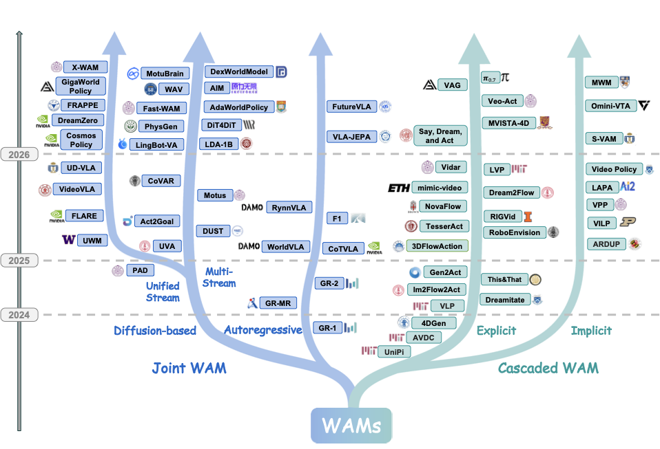
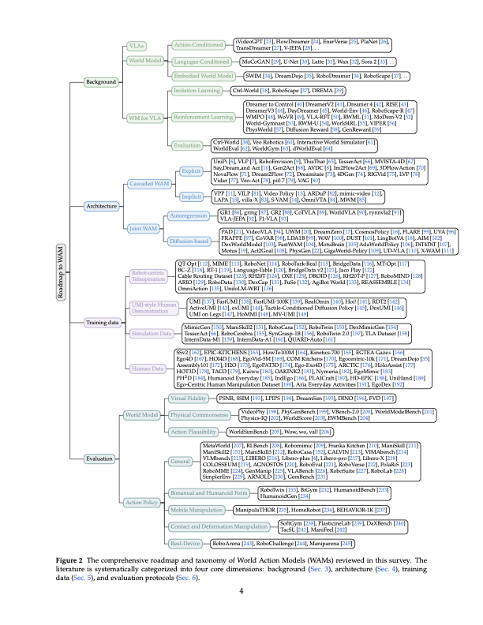
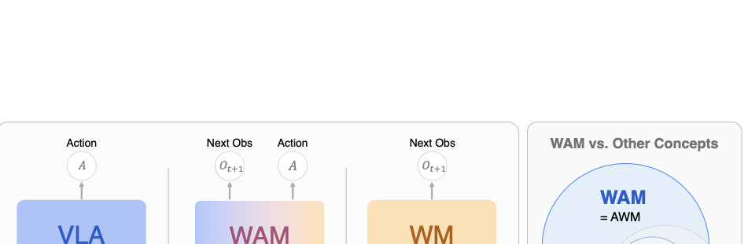
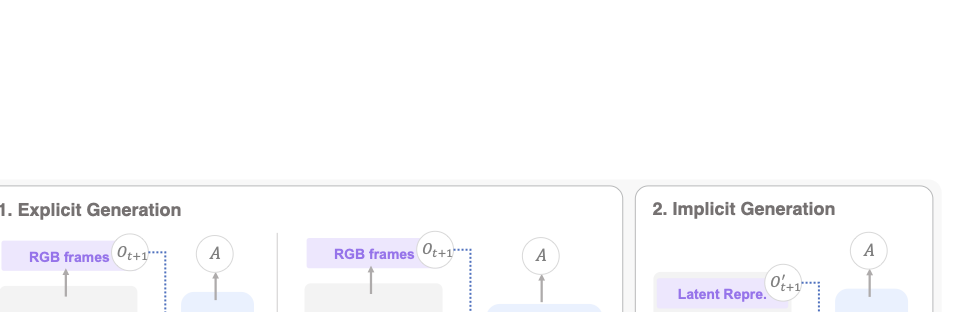
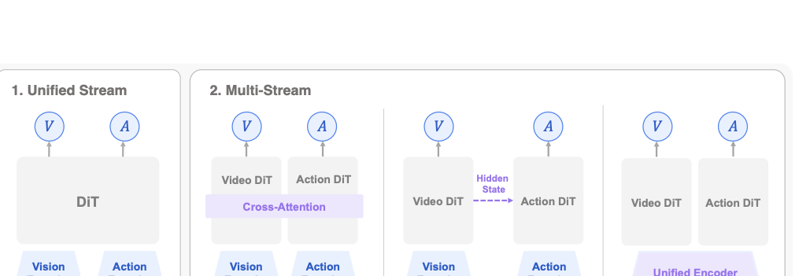
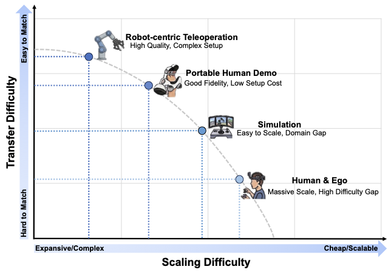

# World Action Models 综述精读报告

> **论文**: World Action Models: The Next Frontier in Embodied AI
> **arXiv**: [2605.12090](https://arxiv.org/abs/2605.12090) [cs.RO]
> **作者**: Siyin Wang, Junhao Shi, Zhaoyang Fu, Xinzhe He, Feihong Liu, Chenchen Yang, Yikang Zhou, Zhaoye Fei, Jingjing Gong, Jinlan Fu, Mike Zheng Shou, Xuanjing Huang, Xipeng Qiu, Yu-Gang Jiang
> **机构**: Fudan University · Shanghai Innovation Institute · National University of Singapore
> **日期**: 2026年5月12日（v1）
> **项目主页**: [Awesome-WAM](https://openmoss.github.io/Awesome-WAM)
> **代码/资源仓库**: [OpenMOSS/Awesome-WAM](https://github.com/OpenMOSS/Awesome-WAM)

---

## 0. 引用信息表

| 信息项 | 内容 |
|--------|------|
| 论文标题 | World Action Models: The Next Frontier in Embodied AI |
| arXiv ID | 2605.12090 [cs.RO] |
| 论文类型 | Survey / Taxonomy / Conceptual Framework |
| 作者 | Siyin Wang, Junhao Shi, Zhaoyang Fu, Xinzhe He, Feihong Liu, Chenchen Yang, Yikang Zhou, Zhaoye Fei, Jingjing Gong, Jinlan Fu, Mike Zheng Shou, Xuanjing Huang, Xipeng Qiu, Yu-Gang Jiang |
| 机构 | Fudan University; Shanghai Innovation Institute; National University of Singapore |
| 提交时间 | 2026-05-12（v1） |
| 核心对象 | World Action Models (WAMs) |
| 关键词 | VLA, World Model, Cascaded WAM, Joint WAM, embodied data, evaluation, physical grounding |

---

## 1. Motivation（问题背景）

### 1.1 VLA 的短板：强语义泛化，但缺少干预后的世界演化

Vision-Language-Action（VLA）模型已经在语义泛化和开放词汇机器人控制上取得进展，例如 [RT-2](https://arxiv.org/abs/2307.15818)、[OpenVLA](https://arxiv.org/abs/2406.09246)、$\pi_0$ / $\pi_{0.5}$ 等路线。但多数 VLA 本质仍是反应式映射：

```text
observation + language  --->  action
```

这种范式能学习“看到什么做什么”，却没有显式建模“如果我这样做，世界会怎样变化”。在接触丰富、长时域、多物体交互的任务里，策略需要的不只是当前语义识别，而是对未来状态和动作后果的预测。

### 1.2 World Model 的短板：会预测世界，但未必会行动

传统 World Model 学习环境动力学：

```text
state + action  --->  next state / future observation
```

它擅长模拟和规划，但如果没有与动作生成端紧密耦合，就可能停留在“可视化未来”或“辅助训练信号”的层面。机器人真正需要的是能把未来预测转化为可执行动作的模型。

### 1.3 本文核心问题

作者认为当前文献已经出现一类新范式：把预测状态建模和动作生成统一起来，但命名、边界、架构和评测仍很碎片化。因此本文提出并系统定义：

> **World Action Models (WAMs)**：统一 predictive state modeling 与 action generation 的 embodied foundation models，目标不是只预测动作，而是建模未来状态和动作的联合分布。

---

## 2. 一句话总结

这篇综述首次系统定义 World Action Models（WAMs），将其形式化为同时建模未来状态和动作的具身基础模型，并把现有方法整理为 Cascaded WAM 与 Joint WAM 两大范式，同时总结训练数据生态、评测协议、开放挑战和未来机会。

> **图 1：Temporal evolution and taxonomy of representative works on World Action Models (WAMs). The left branch illustrates the progression of Joint WAM architectures, which tightly couple world prediction and action generation, showing a divergence into Autoregressive and Diffusion-based representation schemes, with the continuous approach further bifurcating into Unified Stream and Multi-Stream backbones. The right branch summarizes the development of Cascaded WAM pipelines, where world modeling and action execution are primarily decoupled, evolving along Explicit and Implicit representation alignment trajectories. These structural strategies represent the field's dominant exploratory directions in architectural coupling rather than strictly sequential replacements.**（对应论文 Figure 1）
>
> 
>
> - **左侧 Joint WAM**：世界预测和动作生成紧耦合，分为自回归与扩散式路线。
> - **右侧 Cascaded WAM**：先预测未来表示，再从未来表示解码动作，分为显式像素计划和隐式 latent 计划。
> - 这张图不是严格时间替代关系，而是 WAM 架构耦合方式的谱系图。

> **图 2：The comprehensive roadmap and taxonomy of World Action Models (WAMs) reviewed in this survey. The literature is systematically categorized into four core dimensions: background, architecture, training data, and evaluation protocols.**（对应论文 Figure 2）
>
> 
>
> - 这张图是全文综述结构的总地图，把 WAM 文献按照 **背景基础、架构路线、训练数据、评测协议** 四个维度组织。
> - **Background** 部分连接 VLA、World Model、WM for VLA 等前置脉络。
> - **Architecture** 部分是报告后续 Cascaded / Joint WAM 分类的总入口。
> - **Training data / Evaluation** 两部分分别对应数据生态与评测体系，解释为什么 WAM 不是单一模型，而是一个从数据到评测都需要重组的新范式。

---

## 3. 核心贡献

1. **提出 WAM 的正式定义**：把 WAM 与 VLA、World Model、Video Action Model、Video Policy、Action World Model 等概念区分开。
2. **建立两大架构范式**：将现有 WAM 方法划分为 Cascaded WAM 和 Joint WAM，并继续按生成模态、条件机制、动作解码策略细分。
3. **梳理 VLA 与 World Model 的汇合路径**：从模型式 RL、视频世界模型、JEPA latent prediction，到机器人世界模型和 VLA policy learning。
4. **系统总结训练数据生态**：把 WAM 数据来源分为 robot teleoperation、portable human demonstration、simulation、internet-scale egocentric video 等。
5. **提出评测视角与开放问题**：强调需要同时评估 visual fidelity、physical commonsense、action plausibility，以及世界预测和动作生成之间的因果一致性。

---

## 4. 方法详述

### 4.1 问题定义

设具身智能体在每个时刻接收观察 $o \in O$、语言指令 $l \in L$，并输出动作 $a \in A$。后继观察记为 $o'$。

VLA 的目标是直接预测动作：

$$
\mathcal{L}_{\text{VLA}} =
\mathbb{E}_{(o, l, a) \sim \mathcal{D}}
\left[-\log p(a \mid o, l)\right]
$$

World Model 的目标是预测动作干预后的世界：

$$
\mathcal{L}_{\text{WM}} =
\mathbb{E}_{(o, a, o') \sim \mathcal{D}}
\left[-\log p(o' \mid o, a)\right]
$$

WAM 的目标则是统一未来状态和动作：

$$
\mathcal{L}_{\text{WAM}} =
\mathbb{E}_{(o, l, o', a) \sim \mathcal{D}}
\left[-\log p(o', a \mid o, l)\right]
$$

换句话说，WAM 必须满足两个条件：

| 条件 | 含义 |
|------|------|
| Forward Predictive Modeling | 能生成或利用可量化的未来状态表示 $o'$，可以是 RGB、flow、latent、3D、触觉等 |
| Coupled Action Generation | 动作 $a$ 必须与预测未来状态 $o'$ 对齐，可以是联合输出，也可以是 cascaded conditioning |

> **图 3：Conceptual definition and comparison of World Action Models (WAMs). The left panel contrasts the input-output formulations of Vision-Language-Action (VLA) models, WAMs, and standard World Models (WMs), highlighting WAM's capability to jointly predict actions and future observations. The right panel illustrates the conceptual scope of WAMs relative to other paradigms such as Video Action Models (VAMs) and Video Policies.**（对应论文 Figure 3）
>
> 
>
> - **VLA**：从当前观察和语言直接到动作。
> - **WM**：从状态和动作到未来状态。
> - **WAM**：同时面向未来状态预测和动作生成，是一个更完整的 embodied agent 建模目标。

### 4.2 整体 Pipeline

本文不是提出单个新模型，而是提出一个 taxonomy。整体逻辑可以表示为：

```text
VLA 反应式策略
    p(a | o, l)
        │
        ├── 语义泛化强，但缺少显式未来动力学
        ▼
World Model
    p(o' | o, a) 或 p(o' | o, l)
        │
        ├── 会预测未来，但未必与动作生成闭合
        ▼
World Action Model
    p(o', a | o, l)
        │
        ├── Cascaded WAM:
        │       p(o', a | o, l) = p(a | o', o, l) p(o' | o, l)
        │       先世界预测，再动作解码
        │
        └── Joint WAM:
                直接联合建模 p(o', a | o, l)
                世界与动作共享 backbone / tokens / diffusion streams
```

### 4.3 Cascaded WAM

Cascaded WAM 是两阶段流水线：

```text
observation + language
        │
        ▼
World Model: 生成未来视觉计划 / latent future / flow / 3D structure
        │
        ▼
Action Decoder: IDM / geometry extraction / VLA / policy head
        │
        ▼
executable action
```

它的形式化分解是：

$$
p(o', a \mid o, l) =
p(a \mid o', o, l)p(o' \mid o, l)
$$

> **图 5：Schematic comparison of cascaded WAM structures. 1(a) Learned Action: a world model generates an explicit pixel-space future plan, which is mapped to actions by a learned inverse-dynamics or action model. 1(b) Geometric Extraction: the explicit visual plan is converted into actions or trajectories through geometric extraction. 2(a) Latent Representation: the intermediate planning carrier is a latent future representation rather than future RGB frames, and the downstream action model decodes executable commands from it.**（对应论文 Figure 5）
>
> 
>
> - **Learned Action**：视频未来计划经 IDM 或 action model 映射到动作。
> - **Geometric Extraction**：从 optical flow、pose、point tracking 等结构化表示解析动作。
> - **Latent Representation**：不显式生成 RGB，而是在 latent future 上做动作解码。

优点是中间表示可解释、可复用已有视频生成模型；缺点是两阶段误差会叠加，且世界预测和动作解码训练目标分离。

### 4.4 Joint WAM

Joint WAM 直接统一预测世界和动作：

```text
observation + language
        │
        ▼
shared / coupled generative backbone
        │
        ├── future state tokens / latents
        └── action tokens / action chunk
```

作者把 Joint WAM 继续拆成两条主线：

| 主线 | 代表机制 | 优点 | 风险 |
|------|----------|------|------|
| Autoregressive Generation | 离散视觉 token、动作 token、统一 next-token prediction | 易和 LLM/VLM 统一，序列建模清晰 | 长序列成本高，误差累积 |
| Diffusion-based Generation | DiT / Flow Matching / multi-stream denoising | 连续动作和多模态未来更自然 | 推理慢，world-action 耦合接口复杂 |

> **图 6：Taxonomy of the main architectural patterns in the diffusion-based joint WAMs. 1(a) Unified Stream: World and action are integrated within one single DiT backbone, with world modeling realized either explicitly or implicitly. 2(a) Multi-Stream -- Cross-Attention Coupled: separate video and action DiTs are coupled through explicit cross-attention. 2(b) Multi-Stream -- Hidden-State Coupling: intermediate hidden states from the video DiT condition the action DiT. 2(c) Multi-Stream -- Shared Representation: video and action are first fused through a unified encoder before being decoded into their respective outputs.**（对应论文 Figure 6）
>
> 
>
> - **Unified Stream**：世界和动作在单个 DiT backbone 内联合去噪。
> - **Cross-Attention Coupled**：视频 DiT 和动作 DiT 分流，通过 cross-attention 交互。
> - **Hidden-State Coupling**：动作分支读取视频分支中间 hidden states。
> - **Shared Representation**：先融合成统一表示，再分头解码世界和动作。

### 4.5 World Model 如何服务 VLA

> **图 4：Schematic overview of world models for VLA learning and evaluation. World models can support (a) imitation learning by generating or filtering training trajectories, (b) reinforcement learning by enabling imagined interaction and reward-guided policy optimization, (c) reward modeling by producing reward signals from learned dynamics or future outcomes, and (d) policy evaluation by serving as data-driven simulators for virtual rollout and testing. Here, T denotes the rollout trajectories.**（对应论文 Figure 4）
>
> 
>
> - **Imitation Learning**：生成/过滤训练轨迹，扩展专家数据。
> - **RL**：在 world model 里做 imagined rollout，降低真实机器人试错成本。
> - **Reward Modeling**：从未来状态或成功轨迹相似度中产生奖励。
> - **Policy Evaluation**：作为数据驱动 simulator，用于大规模、可复现、安全的策略测试。

### 4.6 训练数据生态

> **图 7：An overview of the embodied data landscape for training World Action Models, mapped across Transfer Difficulty (Y-axis) and Scaling Difficulty (X-axis).**（对应论文 Figure 7）
>
> 
>
> - **Robot-Centric Teleoperation**：动作标注精确、控制 grounding 强，但采集成本高、规模难扩。
> - **Portable Human Demonstrations**：UMI 等方式降低采集门槛，但人到机器人本体迁移仍有 gap。
> - **Simulation Data**：规模和 privileged labels 强，但 sim-to-real gap 是核心问题。
> - **Human/Egocentric Video**：规模极大、含丰富物理先验，但缺少机器人动作标注。

作者强调 WAM 的独特价值是 **unified data digestion**：既能利用 $(o_t, a_t, o_{t+1})$ 三元组学习紧耦合动力学，也可能吸收 action-free video 来学习视觉物理先验。

---

## 5. 训练与推理伪代码

这篇是综述，没有提出单一训练算法。下面给出根据论文定义整理的两类 WAM 抽象伪代码。

### 5.1 Cascaded WAM 训练与推理

```python
def train_cascaded_wam(dataset):
    world_model = init_world_predictor()
    action_decoder = init_action_decoder()

    for obs, lang, future_obs, action in dataset:
        pred_future = world_model(obs, lang)
        loss_world = world_prediction_loss(pred_future, future_obs)
        update(world_model, loss_world)

        # action decoder learns inverse dynamics or future-conditioned policy
        pred_action = action_decoder(obs, lang, future_obs)
        loss_action = action_loss(pred_action, action)
        update(action_decoder, loss_action)

    return world_model, action_decoder


def infer_cascaded_wam(obs, lang):
    imagined_future = world_model(obs, lang)
    action = action_decoder(obs, lang, imagined_future)
    return action
```

### 5.2 Joint WAM 训练与推理

```python
def train_joint_wam(dataset):
    model = init_joint_world_action_model()

    for obs, lang, future_obs, action in dataset:
        pred_future, pred_action = model(obs, lang)
        loss = (
            world_prediction_loss(pred_future, future_obs)
            + action_loss(pred_action, action)
            + coupling_regularizer(pred_future, pred_action)
        )
        update(model, loss)

    return model


def infer_joint_wam(obs, lang):
    future_state, action = model.generate_joint(obs, lang)
    return action
```

### 5.3 评测伪代码：需要联合检验而非分开打榜

```python
def evaluate_wam(model, env_or_dataset):
    metrics = {}

    future, action = model.generate_joint(obs, lang)

    metrics["visual_fidelity"] = compute_psnr_ssim_lpips_fvd(future, target_future)
    metrics["physical_commonsense"] = judge_physics_consistency(future)
    metrics["action_success"] = rollout_success(action)
    metrics["action_plausibility"] = inverse_dynamics_or_trajectory_score(future, action)
    metrics["causal_alignment"] = counterfactual_consistency(model, obs, lang)

    return metrics
```

---

## 6. 实验结论

这篇综述没有单一模型实验，因此“实验结论”应理解为对现有评测体系和基准的系统总结。

### 6.1 World Modeling Capability

| 评测维度 | 代表指标/Benchmark | 关注点 |
|----------|---------------------|--------|
| Visual Fidelity | PSNR, SSIM, LPIPS, DreamSim, DINO, FVD | 视觉质量、时序一致性、语义/感知相似度 |
| Physical Commonsense | VideoPhy, PhyGenBench, VBench-2.0, WorldModelBench, Physics-IQ | 是否遵守物理规律、物体连续性、材料/力学常识 |
| Action Plausibility | WorldScore, EWMBench 等 | 预测未来是否足以反推出可执行动作或合理轨迹 |

论文指出：视频生成指标能衡量“看起来像不像”，但 WAM 真正需要的是“未来是否物理正确、是否可行动、是否与动作因果一致”。

核心公式包括：

$$
\mathrm{PSNR}(x,y)=10\log\left(\frac{\mathrm{MAX}^2}{\mathrm{MSE}(x,y)}\right)
$$

$$
\mathrm{SSIM}(x,y)=
\frac{(2\mu_x\mu_y+C_1)(2\sigma_{xy}+C_2)}
{(\mu_x^2+\mu_y^2+C_1)(\sigma_x^2+\sigma_y^2+C_2)}
$$

$$
\mathrm{FVD}
= \|\mu_r - \mu_g\|_2^2
+ \mathrm{Tr}\!\left(\Sigma_r + \Sigma_g
- 2\left(\Sigma_r\Sigma_g\right)^{1/2}\right)
$$

### 6.2 Action Policy Capability

| 基准类型 | 代表 Benchmark | 关注点 |
----------|----------------|--------|
| General Manipulation | LIBERO, RLBench, Meta-World, CALVIN 等 | 单臂/多任务操作成功率 |
| Bimanual / Humanoid | RoboTwin, ALOHA, humanoid benchmarks | 双臂协作、复杂本体动作 |
| Mobile Manipulation | iTHOR, OmniGibson, Spot/移动机械臂任务 | 导航 + 操作联合 |
| Contact / Deformation | cable routing, cloth, pouring, contact-rich tasks | 接触、柔性物体、力学精度 |
| Real-Robot Benchmarks | Franka, UR5, WidowX, ALOHA, AgileX 等 | sim-to-real、真实部署鲁棒性 |

### 6.3 评测缺口

最重要的结论：当前评测仍然是 decoupled paradigm：

```text
world modeling quality  --->  PSNR/FVD/LPIPS/physics benchmark
action policy quality   --->  task success / trajectory error / collision
```

但 WAM 的核心是 world-action coupling，因此需要新指标：

| 未来指标 | 含义 |
----------|------|
| Counterfactual Consistency | 改变想象未来时，动作是否因果一致地变化 |
| Foresight-Conditioned Success | 执行动作是否真正遵循生成的视觉计划 |
| Intent Alignment | 模型“想象的未来”和“实际执行的动作”是否一致 |
| Prediction-Integrated Safety | 未来预测不确定性是否进入安全监控与动作过滤 |

### 6.4 鲁棒性分析

论文认为 WAM 的鲁棒性瓶颈主要来自 4 个方面：

1. **分布外场景**：世界模型可能生成视觉合理但物理错误的未来。
2. **长时域误差累积**：未来预测 rollout 越长，world drift 和 action compounding 越严重。
3. **本体迁移**：人类视频和机器人动作之间存在 embodiment gap。
4. **延迟税**：联合世界预测和动作生成会拖慢闭环控制频率，DreamZero 7Hz 仍低于传统 VLA 约 50Hz 需求。

---

## 7. KnowHow（核心洞察）

1. **WAM 的本质是把“预测未来”变成“生成动作”的内核**：不是在 VLA 外面加一个视频生成器，而是把未来状态和动作放进同一目标。
2. **Cascaded vs Joint 是 WAM 的第一性分类**：前者可解释、易复用，后者耦合更强、潜在上限更高。
3. **Video Policy 不等于 WAM**：只用视频 backbone 表征再直接出动作，如果没有预测承诺，就更像 video policy 而非 WAM。
4. **像素未来不是唯一未来**：latent、flow、3D、触觉、力反馈都可以是 world state；这为 Fast-WAM、DAWN、JEPA 风格路线提供理论位置。
5. **数据混合比模型结构同样关键**：robot data 给精确动作 grounding，human/egocentric video 给规模化物理和任务先验。
6. **评测必须从“两个分数”走向“耦合分数”**：WAM 不能只分别看视频质量和任务成功率，关键是动作是否因果 grounded in imagined future。
7. **延迟税是 WAM 落地的硬门槛**：显式未来建模越强，闭环频率越难满足，未来需要 task-adaptive predictive fidelity。
8. **安全性是 WAM 双刃剑**：预测未来能用于动作前验证，但错误未来也可能让模型更自信地执行危险动作。

---

## 8. arXiv Appendix 关键点总结

论文源文件没有独立 appendix；其主体章节已经承担 survey 结构。按 A/B/C/D/E/F/G 组织如下：

| 部分 | 对应章节 | 核心内容 |
|------|----------|----------|
| A | Introduction | 说明 VLA 缺少显式干预动力学，WAM 需要统一未来状态和动作。 |
| B | Definitions and Formalism | 给出 VLA、WM、WAM 的概率目标，并区分 VAM、Video Policy、AWM。 |
| C | VLAs and World Models | 回顾 VLA、action-conditioned WM、language-conditioned WM、embodied WM，以及 WM 如何服务 VLA 学习和评测。 |
| D | Architecture | 将 WAM 分成 Cascaded 与 Joint 两大类，细分 pixel/latent、autoregressive/diffusion、single-stream/multi-stream。 |
| E | Training Data | 总结 robot teleoperation、portable human demos、simulation、human/egocentric video 四类数据及其 scaling/transfer trade-off。 |
| F | Evaluation | 总结世界建模评测、动作策略评测，并指出缺少 world-action causal alignment 指标。 |
| G | Open Challenges | 提出 architectural coupling、多模态物理状态、数据混合、长时域规划、推理延迟、联合评测、安全部署等开放问题。 |

---

## 9. 总结

这篇综述的核心价值是给 WAM 这个快速膨胀的方向划边界、建 taxonomy、定问题。它把 WAM 明确放在 VLA 的下一阶段：不是只从视觉语言直接生成动作，而是把未来世界状态作为动作生成的必要组成部分。

三点最重要贡献：

1. **定义贡献**：WAM = 统一 predictive state modeling 与 action generation 的 embodied foundation model，目标是 $p(o', a \mid o, l)$。
2. **架构贡献**：Cascaded WAM 与 Joint WAM 是理解当前方法的主坐标系，能把 UniPi、$\pi_{0.7}$、VLA-JEPA、Fast-WAM、AIM、DAWN 等路线放到同一图谱里。
3. **研究路线贡献**：未来关键不是盲目生成更清晰的视频，而是找到最低成本、最物理 grounded、最能因果约束动作的未来表示。

最重要洞察：**WAM 的下一步不是“世界模型 + 动作头”的简单拼接，而是世界预测、动作生成、数据混合、评测指标和安全验证一起重构。**

---

## 参考链接

| 资源 | 链接 |
|------|------|
| **论文** | [arXiv:2605.12090](https://arxiv.org/abs/2605.12090) |
| **PDF** | [arXiv PDF](https://arxiv.org/pdf/2605.12090) |
| **项目主页** | [Awesome-WAM](https://openmoss.github.io/Awesome-WAM) |
| **代码/资源仓库** | [GitHub: OpenMOSS/Awesome-WAM](https://github.com/OpenMOSS/Awesome-WAM) |
| **博客解读** | [待验证] |
